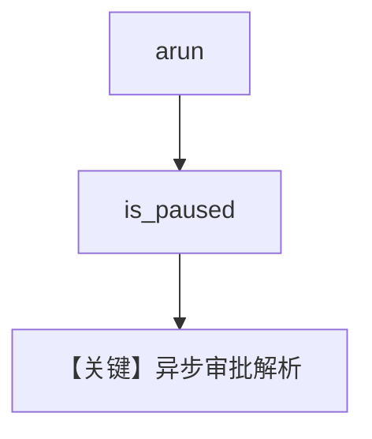

# approval_async.py — 实现原理分析

<!-- cookbook-py-source:start -->
## 完整源码

```python
"""
Approval Async
=============================

Async approval-backed HITL: @approval with async agent run.
"""

import asyncio
import json
import os
import time

import httpx
from agno.agent import Agent
from agno.approval import approval
from agno.db.sqlite import SqliteDb
from agno.models.openai import OpenAIResponses
from agno.tools import tool

DB_FILE = "tmp/approvals_async_test.db"


@approval
@tool(requires_confirmation=True)
def get_top_hackernews_stories(num_stories: int) -> str:
    """Fetch top stories from Hacker News.

    Args:
        num_stories (int): Number of stories to retrieve.

    Returns:
        str: JSON string of story details.
    """
    response = httpx.get("https://hacker-news.firebaseio.com/v0/topstories.json")
    story_ids = response.json()
    stories = []
    for story_id in story_ids[:num_stories]:
        story = httpx.get(
            f"https://hacker-news.firebaseio.com/v0/item/{story_id}.json"
        ).json()
        story.pop("text", None)
        stories.append(story)
    return json.dumps(stories)


# ---------------------------------------------------------------------------
# Create Agent
# ---------------------------------------------------------------------------
db = SqliteDb(
    db_file=DB_FILE, session_table="agent_sessions", approvals_table="approvals"
)
agent = Agent(
    model=OpenAIResponses(id="gpt-5-mini"),
    tools=[get_top_hackernews_stories],
    markdown=True,
    db=db,
)


# ---------------------------------------------------------------------------
# Run Agent
# ---------------------------------------------------------------------------
async def main():
    # Clean up from previous runs
    if os.path.exists(DB_FILE):
        os.remove(DB_FILE)
    os.makedirs("tmp", exist_ok=True)

    # Re-create after cleanup
    _db = SqliteDb(
        db_file=DB_FILE, session_table="agent_sessions", approvals_table="approvals"
    )
    _agent = Agent(
        model=OpenAIResponses(id="gpt-5-mini"),
        tools=[get_top_hackernews_stories],
        markdown=True,
        db=_db,
    )

    # Step 1: Async run - agent will pause
    print("--- Step 1: Running agent async (expects pause) ---")
    run_response = await _agent.arun("Fetch the top 2 hackernews stories.")
    print(f"Run status: {run_response.status}")
    assert run_response.is_paused, f"Expected paused, got {run_response.status}"
    print("Agent paused as expected.")

    # Step 2: Check approval record in DB
    print("\n--- Step 2: Checking approval record in DB ---")
    approvals_list, total = _db.get_approvals(status="pending")
    print(f"Pending approvals: {total}")
    assert total >= 1, f"Expected at least 1 pending approval, got {total}"
    approval_record = approvals_list[0]
    print(f"  Approval ID: {approval_record['id']}")
    print(f"  Status:      {approval_record['status']}")

    # Step 3: Confirm and continue async
    print("\n--- Step 3: Confirming and continuing async ---")
    for requirement in run_response.active_requirements:
        if requirement.needs_confirmation:
            print(f"  Confirming tool: {requirement.tool_execution.tool_name}")
            requirement.confirm()

    run_response = await _agent.acontinue_run(
        run_id=run_response.run_id,
        requirements=run_response.requirements,
    )
    print(f"Run status after continue: {run_response.status}")
    assert not run_response.is_paused, "Expected run to complete"

    # Step 4: Resolve approval
    print("\n--- Step 4: Resolving approval in DB ---")
    resolved = _db.update_approval(
        approval_record["id"],
        expected_status="pending",
        status="approved",
        resolved_by="async_user",
        resolved_at=int(time.time()),
    )
    assert resolved is not None, "Approval resolution failed"
    print(f"  Resolved status: {resolved['status']}")

    # Step 5: Verify clean state
    print("\n--- Step 5: Verifying no pending approvals ---")
    count = _db.get_pending_approval_count()
    print(f"Remaining pending approvals: {count}")
    assert count == 0

    print("\n--- All checks passed! ---")
    print(f"\nAgent output (truncated): {str(run_response.content)[:200]}...")


if __name__ == "__main__":
    asyncio.run(main())
```

<!-- cookbook-py-source:end -->

> 源文件：`cookbook/02_agents/11_approvals/approval_async.py`

## 概述

本示例为 **approval_basic 的异步版**：`await _agent.arun(...)`，暂停后同样查 `get_approvals`，再用异步续跑 API（脚本内 `acontinue_run` 或等价，以 `.py` 后半为准）。

**核心配置一览：** 与 basic 相同模式，`DB_FILE` 为 `tmp/approvals_async_test.db`。

## 运行机制与因果链

异步事件循环中完成 **非阻塞** 审批集成（如 WebSocket 通知）。

## System Prompt 组装

无自定义 `instructions`。

## Mermaid 流程图


```mermaid
flowchart TD
    A["arun"] --> P["is_paused"]
    P --> B["【关键】异步审批解析"]
```

## 关键源码文件索引

| 文件 | 作用 |
|------|------|
| `agno/agent/agent.py` | `arun`；`acontinue_run` |
