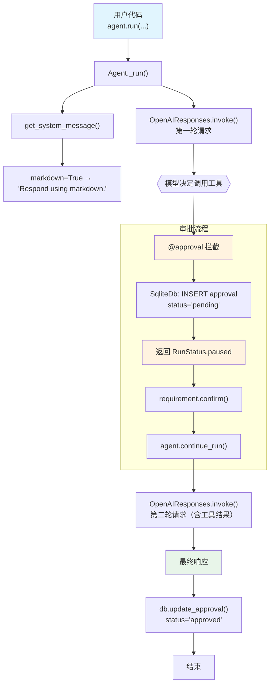

# approval_basic.py — 实现原理分析

> 源文件：`cookbook/02_agents/11_approvals/approval_basic.py`

## 概述

本示例展示 Agno 的 **`@approval` 审批系统**机制：通过 `@approval` 装饰器 + `@tool(requires_confirmation=True)` 组合，在工具执行前创建 `pending` 状态的 DB 审批记录，Agent 运行暂停等待人工确认，确认后继续执行并更新审批状态。

**核心配置一览：**

| 配置项 | 值 | 说明 |
|--------|------|------|
| `model` | `OpenAIResponses(id="gpt-5-mini")` | Responses API |
| `tools` | `[get_top_hackernews_stories]` | 带 @approval + requires_confirmation 的工具 |
| `markdown` | `True` | Markdown 格式输出 |
| `db` | `SqliteDb(db_file=..., approvals_table="approvals")` | 启用审批记录持久化 |
| `description` | `None` | 未设置 |
| `instructions` | `None` | 未设置 |

## 架构分层

```
用户代码层                          agno 审批系统层
┌──────────────────────────┐      ┌─────────────────────────────────────┐
│ approval_basic.py        │      │ @approval 装饰器                     │
│                          │      │  └─ 在工具前后插入审批逻辑           │
│ @approval                │      │                                      │
│ @tool(requires_          │─────>│ Agent._run()                         │
│   confirmation=True)     │      │  ├─ Model 请求 → 决定调用工具        │
│                          │      │  ├─ 检测到 requires_confirmation      │
│ agent.run(...)           │      │  │   → 创建 pending 审批记录到 DB    │
│ run_response.is_paused   │      │  │   → 返回 RunStatus.paused         │
│                          │      │  └─ agent.continue_run() 恢复执行    │
│ agent.continue_run(...)  │      │                                      │
│ db.update_approval(...)  │      │ SqliteDb.approvals_table             │
└──────────────────────────┘      │  get_approvals() / update_approval() │
                                  └─────────────────────────────────────┘
                                             │
                                             ▼
                                  ┌──────────────────────┐
                                  │ OpenAIResponses      │
                                  │ gpt-5-mini           │
                                  └──────────────────────┘
```

## 核心组件解析

### @approval 装饰器

`@approval` 是 Agno 的预置审批中间件。当工具被调用时：
1. **执行前**：在 DB `approvals_table` 插入 `status="pending"` 的审批记录
2. **暂停运行**：Agent 返回 `RunStatus.paused`，`run_response.is_paused=True`
3. **等待确认**：调用方通过 `requirement.confirm()` 或 `requirement.reject()` 设置决策
4. **继续执行**：调用 `agent.continue_run()` 恢复运行

```python
@approval                           # 创建 DB 审批记录
@tool(requires_confirmation=True)   # 触发 HITL 暂停
def get_top_hackernews_stories(num_stories: int) -> str:
    ...
```

### SqliteDb 审批表配置

```python
db = SqliteDb(
    db_file="tmp/approvals_test.db",
    session_table="agent_sessions",   # 会话持久化表
    approvals_table="approvals",      # 审批记录表（@approval 写入）
)
```

### 审批生命周期

```python
# 1. 运行并暂停
run_response = agent.run("Fetch the top 2 hackernews stories.")
assert run_response.is_paused  # RunStatus.paused

# 2. 查询 DB 中的 pending 审批
approvals_list, total = db.get_approvals(status="pending")
approval_record = approvals_list[0]
# approval_record['id'], 'run_id', 'status'="pending", 'source_type'

# 3. 确认后继续运行
for requirement in run_response.active_requirements:
    if requirement.needs_confirmation:
        requirement.confirm()  # 或 requirement.reject(reason)

run_response = agent.continue_run(
    run_id=run_response.run_id,
    requirements=run_response.requirements,
)

# 4. 更新 DB 审批记录
db.update_approval(
    approval_record["id"],
    expected_status="pending",   # 乐观锁：防止并发修改
    status="approved",
    resolved_by="test_user",
    resolved_at=int(time.time()),
)

# 5. 验证无 pending 记录
count = db.get_pending_approval_count()
```

### RunResponse 审批字段

| 字段 | 说明 |
|------|------|
| `run_response.is_paused` | 是否因 HITL 暂停 |
| `run_response.status` | `RunStatus.paused` / `RunStatus.completed` |
| `run_response.run_id` | 用于 continue_run 恢复 |
| `run_response.active_requirements` | 待处理的 HITL 需求列表 |
| `requirement.needs_confirmation` | 是否需要确认 |
| `requirement.tool_execution.tool_name` | 被暂停的工具名 |

## System Prompt 组装

| 序号 | 组成部分 | 本文件中的值/来源 | 是否生效 |
|------|---------|-----------------|---------|
| 3.2.1 | `markdown` | `True` | 是 |
| 其他 | instructions/description/context 等 | 均未设置 | 否 |

### 最终 System Prompt

```text
Respond using markdown.
```

## 完整 API 请求

```python
# 第一轮：模型决定调用工具
client.responses.create(
    model="gpt-5-mini",
    input=[
        {"role": "developer", "content": "Respond using markdown."},
        {"role": "user", "content": "Fetch the top 2 hackernews stories."}
    ],
    tools=[{
        "type": "function",
        "name": "get_top_hackernews_stories",
        "description": "Fetch top stories from Hacker News.",
        "parameters": {
            "type": "object",
            "properties": {
                "num_stories": {"type": "integer", "description": "Number of stories to retrieve."}
            },
            "required": ["num_stories"]
        }
    }],
    stream=True,
    stream_options={"include_usage": True}
)
# → 模型返回工具调用 → @approval 检测到 requires_confirmation → 暂停，创建 DB 记录

# 第二轮（continue_run 后）：携带工具执行结果
client.responses.create(
    model="gpt-5-mini",
    input=[
        {"role": "developer", "content": "Respond using markdown."},
        {"role": "user", "content": "Fetch the top 2 hackernews stories."},
        {"role": "assistant", "content": None, "tool_calls": [...]},
        {"role": "tool", "content": "[{...story data...}]"}  # 工具执行结果
    ],
    ...
)
```

## Mermaid 流程图



## 关键源码文件索引

| 文件 | 关键函数/类 | 作用 |
|------|------------|------|
| `agno/approval/__init__.py` | `approval` | 审批装饰器入口 |
| `agno/db/sqlite/` | `SqliteDb` | approvals_table CRUD |
| `agno/run/base.py` | `RunStatus.paused` | 暂停状态枚举 |
| `agno/agent/agent.py` | `continue_run()` | 恢复暂停的运行 |
| `agno/agent/_messages.py` | `get_system_message()` L106 | System prompt 组装 |
