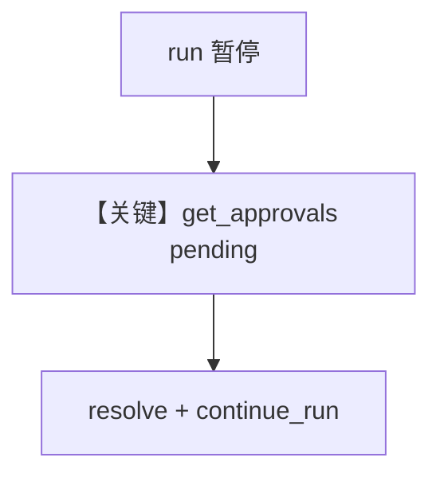

# approval_basic.py — 实现原理分析

> 源文件：`cookbook/02_agents/11_approvals/approval_basic.py`

## 概述

本示例展示 **`@approval` 装饰器与持久化审批表**：在 `@approval` + `@tool(requires_confirmation=True)` 下，暂停时在 **`approvals_table`** 写入 **pending** 记录，解析后 `continue_run`；脚本校验 `db.get_approvals`。

**核心配置一览：**

| 配置项 | 值 |
|--------|-----|
| `model` | `OpenAIResponses(id="gpt-5-mini")` |
| `tools` | `get_top_hackernews_stories`（双层装饰器） |
| `db` | `SqliteDb(..., approvals_table="approvals")` |
| `markdown` | `True` |

## 核心组件解析

`@approval` 将 HITL 与 **可查询的审批行** 绑定，区别于仅内存确认。

### 运行机制与因果链

清理 DB 文件 → 运行 → 断言 pending → 批准/拒绝 → 更新状态。

## System Prompt 组装

无自定义 `instructions`。

## Mermaid 流程图

```mermaid
flowchart TD
    R["run 暂停"] --> D["【关键】get_approvals pending"]
    D --> V["resolve + continue_run"]
```

## 关键源码文件索引

| 文件 | 作用 |
|------|------|
| `agno/approval` | `@approval` |
| `agno/db` | `get_approvals` |
