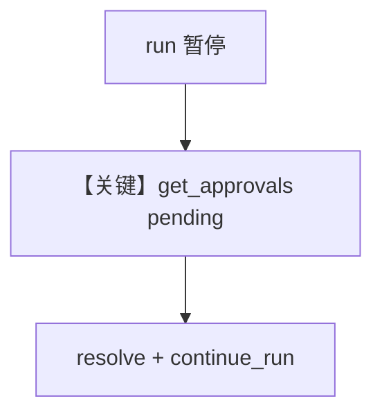

# approval_basic.py — 实现原理分析

<!-- cookbook-py-source:start -->
## 完整源码

```python
"""
Approval Basic
=============================

Approval-backed HITL: @approval + @tool(requires_confirmation=True) with persistent DB record.
"""

import json
import os
import time

import httpx
from agno.agent import Agent
from agno.approval import approval
from agno.db.sqlite import SqliteDb
from agno.models.openai import OpenAIResponses
from agno.tools import tool

DB_FILE = "tmp/approvals_test.db"


@approval
@tool(requires_confirmation=True)
def get_top_hackernews_stories(num_stories: int) -> str:
    """Fetch top stories from Hacker News.

    Args:
        num_stories (int): Number of stories to retrieve.

    Returns:
        str: JSON string of story details.
    """
    response = httpx.get("https://hacker-news.firebaseio.com/v0/topstories.json")
    story_ids = response.json()
    stories = []
    for story_id in story_ids[:num_stories]:
        story = httpx.get(
            f"https://hacker-news.firebaseio.com/v0/item/{story_id}.json"
        ).json()
        story.pop("text", None)
        stories.append(story)
    return json.dumps(stories)


# ---------------------------------------------------------------------------
# Create Agent
# ---------------------------------------------------------------------------
db = SqliteDb(
    db_file=DB_FILE, session_table="agent_sessions", approvals_table="approvals"
)
agent = Agent(
    model=OpenAIResponses(id="gpt-5-mini"),
    tools=[get_top_hackernews_stories],
    markdown=True,
    db=db,
)

# ---------------------------------------------------------------------------
# Run Agent
# ---------------------------------------------------------------------------
if __name__ == "__main__":
    # Clean up from previous runs
    if os.path.exists(DB_FILE):
        os.remove(DB_FILE)
    os.makedirs("tmp", exist_ok=True)

    # Re-create after cleanup
    db = SqliteDb(
        db_file=DB_FILE, session_table="agent_sessions", approvals_table="approvals"
    )
    agent = Agent(
        model=OpenAIResponses(id="gpt-5-mini"),
        tools=[get_top_hackernews_stories],
        markdown=True,
        db=db,
    )

    # Step 1: Run - agent will pause because the tool requires approval
    print("--- Step 1: Running agent (expects pause) ---")
    run_response = agent.run("Fetch the top 2 hackernews stories.")
    print(f"Run status: {run_response.status}")
    assert run_response.is_paused, f"Expected paused, got {run_response.status}"
    print("Agent paused as expected.")

    # Step 2: Check that an approval record was created in the DB
    print("\n--- Step 2: Checking approval record in DB ---")
    approvals_list, total = db.get_approvals(status="pending")
    print(f"Pending approvals: {total}")
    assert total >= 1, f"Expected at least 1 pending approval, got {total}"
    approval_record = approvals_list[0]
    print(f"  Approval ID: {approval_record['id']}")
    print(f"  Run ID:      {approval_record['run_id']}")
    print(f"  Status:      {approval_record['status']}")
    print(f"  Source:      {approval_record['source_type']}")
    print(f"  Context:     {approval_record.get('context')}")

    # Step 3: Confirm the requirement and continue the run
    print("\n--- Step 3: Confirming and continuing ---")
    for requirement in run_response.active_requirements:
        if requirement.needs_confirmation:
            print(f"  Confirming tool: {requirement.tool_execution.tool_name}")
            requirement.confirm()

    run_response = agent.continue_run(
        run_id=run_response.run_id,
        requirements=run_response.requirements,
    )
    print(f"Run status after continue: {run_response.status}")
    assert not run_response.is_paused, "Expected run to complete, but it's still paused"

    # Step 4: Resolve the approval record in the DB
    print("\n--- Step 4: Resolving approval in DB ---")
    resolved = db.update_approval(
        approval_record["id"],
        expected_status="pending",
        status="approved",
        resolved_by="test_user",
        resolved_at=int(time.time()),
    )
    assert resolved is not None, "Approval resolution failed (possible race condition)"
    print(f"  Resolved status: {resolved['status']}")
    print(f"  Resolved by:     {resolved['resolved_by']}")

    # Step 5: Verify no more pending approvals
    print("\n--- Step 5: Verifying no pending approvals ---")
    count = db.get_pending_approval_count()
    print(f"Remaining pending approvals: {count}")
    assert count == 0, f"Expected 0 pending approvals, got {count}"

    print("\n--- All checks passed! ---")
    print(f"\nAgent output (truncated): {str(run_response.content)[:200]}...")
```

<!-- cookbook-py-source:end -->

> 源文件：`cookbook/02_agents/11_approvals/approval_basic.py`

## 概述

本示例展示 **`@approval` 装饰器与持久化审批表**：在 `@approval` + `@tool(requires_confirmation=True)` 下，暂停时在 **`approvals_table`** 写入 **pending** 记录，解析后 `continue_run`；脚本校验 `db.get_approvals`。

**核心配置一览：**

| 配置项 | 值 |
|--------|-----|
| `model` | `OpenAIResponses(id="gpt-5-mini")` |
| `tools` | `get_top_hackernews_stories`（双层装饰器） |
| `db` | `SqliteDb(..., approvals_table="approvals")` |
| `markdown` | `True` |

## 核心组件解析

`@approval` 将 HITL 与 **可查询的审批行** 绑定，区别于仅内存确认。

### 运行机制与因果链

清理 DB 文件 → 运行 → 断言 pending → 批准/拒绝 → 更新状态。

## System Prompt 组装

无自定义 `instructions`。

## Mermaid 流程图


```mermaid
flowchart TD
    R["run 暂停"] --> D["【关键】get_approvals pending"]
    D --> V["resolve + continue_run"]
```

## 关键源码文件索引

| 文件 | 作用 |
|------|------|
| `agno/approval` | `@approval` |
| `agno/db` | `get_approvals` |
