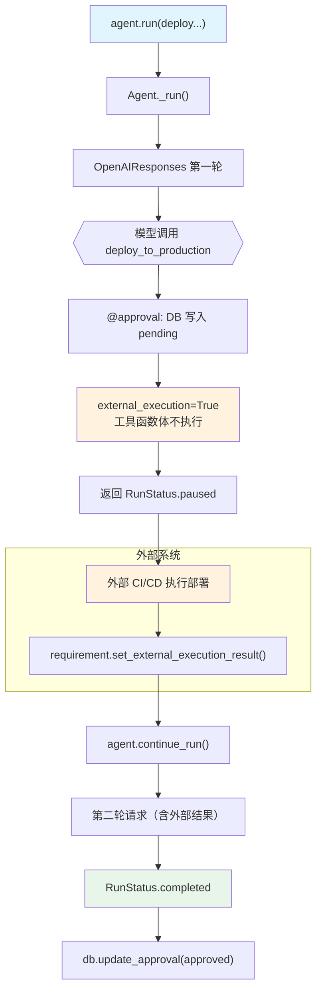

# approval_external_execution.py — 实现原理分析

> 源文件：`cookbook/02_agents/11_approvals/approval_external_execution.py`

## 概述

本示例展示 Agno 的 **`@approval` + `external_execution` 外部执行**机制：通过 `@tool(external_execution=True)` 让工具函数体不在 Agent 进程内执行，而是将执行权交给外部系统（如 CI/CD 流水线），外部执行完成后通过 `requirement.set_external_execution_result()` 注入结果。

**核心配置一览：**

| 配置项 | 值 | 说明 |
|--------|------|------|
| `model` | `OpenAIResponses(id="gpt-5-mini")` | Responses API |
| `tools` | `[deploy_to_production]` | @approval + external_execution=True |
| `markdown` | `True` | Markdown 格式 |
| `db` | `SqliteDb(approvals_table="approvals")` | 审批记录持久化 |

## 架构分层

```
用户代码层                          外部执行流程
┌──────────────────────────┐      ┌─────────────────────────────────────┐
│ approval_external_       │      │ Agent._run()                         │
│ execution.py             │      │  ├─ 模型请求 → 工具调用              │
│                          │─────>│  ├─ @approval: 创建 DB pending 记录  │
│ @approval                │      │  ├─ external_execution=True          │
│ @tool(external_          │      │  │   → 暂停，工具函数体不执行        │
│   execution=True)        │      │  └─ 返回 RunStatus.paused            │
│                          │      │                                      │
│ req.set_external_        │      │ 外部系统执行实际操作                  │
│ execution_result(...)    │      │  └─ 注入结果到 requirement           │
│                          │      │                                      │
│ agent.continue_run()     │      │ agent.continue_run()                 │
└──────────────────────────┘      │  └─ 将外部结果作为工具返回值继续     │
                                  └─────────────────────────────────────┘
```

## 核心组件解析

### external_execution vs requires_confirmation 对比

| 特性 | `requires_confirmation=True` | `external_execution=True` |
|------|------------------------------|---------------------------|
| 工具函数是否执行 | 是（确认后执行） | 否（完全由外部执行） |
| 暂停原因 | 等待人工确认 | 等待外部系统返回结果 |
| 恢复方式 | `requirement.confirm()` | `requirement.set_external_execution_result()` |
| 典型场景 | 审批敏感操作 | CI/CD 部署、外部 API 调用 |

```python
@approval
@tool(external_execution=True)  # 工具函数体不会被 Agent 执行
def deploy_to_production(service_name: str, version: str) -> str:
    """Deploy a service to production."""
    return f"Deployed {service_name} v{version}"  # 此行代码永远不会运行
```

### 外部结果注入

```python
# 外部系统执行完成后，注入结果
for requirement in run_response.active_requirements:
    if requirement.needs_external_execution:
        requirement.set_external_execution_result(
            "Deployed auth-service v2.1.0"  # 外部系统的实际执行结果
        )

# 携带外部结果继续运行
run_response = agent.continue_run(
    run_id=run_response.run_id,
    requirements=run_response.requirements,
)
```

### DB 过滤查询

```python
# 可按 approval_type 过滤（default="required"）
approvals_list, total = db.get_approvals(
    status="pending",
    approval_type="required"
)
```

## System Prompt 组装

| 序号 | 组成部分 | 值 | 是否生效 |
|------|---------|-----|---------|
| 3.2.1 | `markdown` | `True` | 是 |
| 其他 | 均未设置 | - | 否 |

### 最终 System Prompt

```text
Respond using markdown.
```

## 完整 API 请求

```python
# 第一轮：模型调用工具，external_execution 暂停
client.responses.create(
    model="gpt-5-mini",
    input=[
        {"role": "developer", "content": "Respond using markdown."},
        {"role": "user", "content": "Deploy the auth-service version 2.1.0 to production."}
    ],
    tools=[{
        "type": "function",
        "name": "deploy_to_production",
        "parameters": {
            "properties": {
                "service_name": {"type": "string"},
                "version": {"type": "string"}
            }
        }
    }],
    stream=True
)

# 第二轮（外部结果注入后 continue_run）
client.responses.create(
    model="gpt-5-mini",
    input=[
        {"role": "developer", "content": "Respond using markdown."},
        {"role": "user", "content": "Deploy the auth-service version 2.1.0 to production."},
        {"role": "assistant", "tool_calls": [{"name": "deploy_to_production", "arguments": {...}}]},
        {"role": "tool", "content": "Deployed auth-service v2.1.0"}  # 外部注入的结果
    ],
    ...
)
```

## Mermaid 流程图



## 关键源码文件索引

| 文件 | 关键函数/类 | 作用 |
|------|------------|------|
| `agno/approval/__init__.py` | `approval` | 审批装饰器 |
| `agno/tools/__init__.py` | `tool(external_execution=True)` | 外部执行标记 |
| `agno/agent/agent.py` | `continue_run()` | 注入外部结果后恢复 |
| `agno/db/sqlite/` | `get_approvals(approval_type=)` | 过滤查询 |
