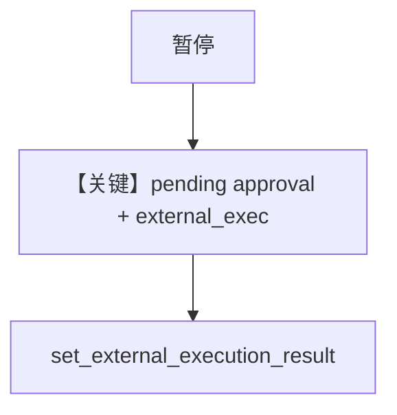

# approval_external_execution.py — 实现原理分析

> 源文件：`cookbook/02_agents/11_approvals/approval_external_execution.py`

## 概述

本示例展示 **`@approval` + `external_execution=True`**：`deploy_to_production` 需审批且由外部执行，暂停后检查 DB，再 `set_external_execution_result` 与 `continue_run`。

**核心配置一览：**

| 装饰器 | `@approval` + `@tool(external_execution=True)` |
|--------|--------------------------------------------------|
| `db` | `approvals_table="approvals"` |

## 运行机制与因果链

合并 **审批合规** 与 **外部系统真实部署** 两条控制面。

## Mermaid 流程图

```mermaid
flowchart TD
    P["暂停"] --> A["【关键】pending approval + external_exec"]
    A --> S["set_external_execution_result"]
```

## 关键源码文件索引

| 文件 | 作用 |
|------|------|
| `agno/approval` | 与 external 工具组合 |
