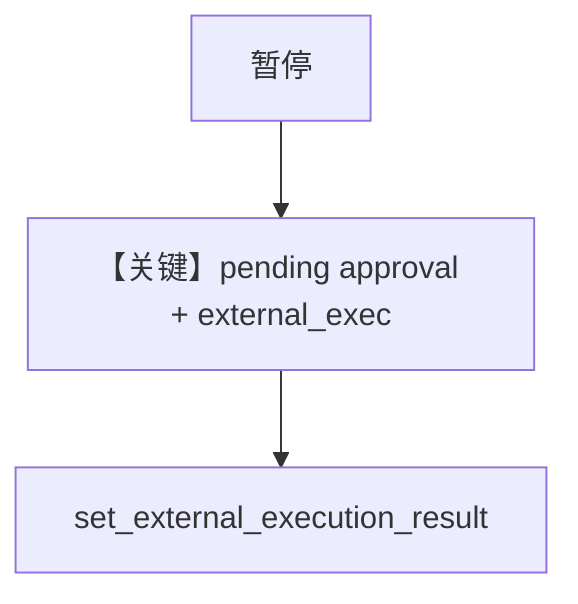

# approval_external_execution.py — 实现原理分析

<!-- cookbook-py-source:start -->
## 完整源码

```python
"""
Approval External Execution
=============================

Approval + external execution HITL: @approval + @tool(external_execution=True).
"""

import os
import time

from agno.agent import Agent
from agno.approval import approval
from agno.db.sqlite import SqliteDb
from agno.models.openai import OpenAIResponses
from agno.tools import tool

DB_FILE = "tmp/approvals_test.db"


@approval
@tool(external_execution=True)
def deploy_to_production(service_name: str, version: str) -> str:
    """Deploy a service to production.

    Args:
        service_name (str): The name of the service to deploy.
        version (str): The version to deploy.

    Returns:
        str: Confirmation of the deployment.
    """
    return f"Deployed {service_name} v{version}"


# ---------------------------------------------------------------------------
# Create Agent
# ---------------------------------------------------------------------------
db = SqliteDb(
    db_file=DB_FILE, session_table="agent_sessions", approvals_table="approvals"
)
agent = Agent(
    model=OpenAIResponses(id="gpt-5-mini"),
    tools=[deploy_to_production],
    markdown=True,
    db=db,
)

# ---------------------------------------------------------------------------
# Run Agent
# ---------------------------------------------------------------------------
if __name__ == "__main__":
    # Clean up from previous runs
    if os.path.exists(DB_FILE):
        os.remove(DB_FILE)
    os.makedirs("tmp", exist_ok=True)

    # Re-create after cleanup
    db = SqliteDb(
        db_file=DB_FILE, session_table="agent_sessions", approvals_table="approvals"
    )
    agent = Agent(
        model=OpenAIResponses(id="gpt-5-mini"),
        tools=[deploy_to_production],
        markdown=True,
        db=db,
    )

    # Step 1: Run - agent will pause
    print("--- Step 1: Running agent (expects pause) ---")
    run_response = agent.run("Deploy the auth-service version 2.1.0 to production.")
    print(f"Run status: {run_response.status}")
    assert run_response.is_paused, f"Expected paused, got {run_response.status}"
    print("Agent paused as expected.")

    # Step 2: Check that an approval record was created in the DB
    print("\n--- Step 2: Checking approval record in DB ---")
    approvals_list, total = db.get_approvals(status="pending", approval_type="required")
    print(f"Pending approvals: {total}")
    assert total >= 1, f"Expected at least 1 pending approval, got {total}"
    approval_record = approvals_list[0]
    print(f"  Approval ID: {approval_record['id']}")
    print(f"  Run ID:      {approval_record['run_id']}")
    print(f"  Status:      {approval_record['status']}")
    print(f"  Source:      {approval_record['source_type']}")
    print(f"  Context:     {approval_record.get('context')}")

    # Step 3: Set external execution result and continue
    print("\n--- Step 3: Setting external result and continuing ---")
    for requirement in run_response.active_requirements:
        if requirement.needs_external_execution:
            print(f"  Setting result for tool: {requirement.tool_execution.tool_name}")
            requirement.set_external_execution_result("Deployed auth-service v2.1.0")

    run_response = agent.continue_run(
        run_id=run_response.run_id,
        requirements=run_response.requirements,
    )
    print(f"Run status after continue: {run_response.status}")
    assert not run_response.is_paused, "Expected run to complete, but it's still paused"

    # Step 4: Resolve the approval record in the DB
    print("\n--- Step 4: Resolving approval in DB ---")
    resolved = db.update_approval(
        approval_record["id"],
        expected_status="pending",
        status="approved",
        resolved_by="test_user",
        resolved_at=int(time.time()),
    )
    assert resolved is not None, "Approval resolution failed (possible race condition)"
    print(f"  Resolved status: {resolved['status']}")
    print(f"  Resolved by:     {resolved['resolved_by']}")

    # Step 5: Verify no more pending approvals
    print("\n--- Step 5: Verifying no pending approvals ---")
    count = db.get_pending_approval_count()
    print(f"Remaining pending approvals: {count}")
    assert count == 0, f"Expected 0 pending approvals, got {count}"

    print("\n--- All checks passed! ---")
    print(f"\nAgent output (truncated): {str(run_response.content)[:200]}...")
```

<!-- cookbook-py-source:end -->

> 源文件：`cookbook/02_agents/11_approvals/approval_external_execution.py`

## 概述

本示例展示 **`@approval` + `external_execution=True`**：`deploy_to_production` 需审批且由外部执行，暂停后检查 DB，再 `set_external_execution_result` 与 `continue_run`。

**核心配置一览：**

| 装饰器 | `@approval` + `@tool(external_execution=True)` |
|--------|--------------------------------------------------|
| `db` | `approvals_table="approvals"` |

## 运行机制与因果链

合并 **审批合规** 与 **外部系统真实部署** 两条控制面。

## Mermaid 流程图


```mermaid
flowchart TD
    P["暂停"] --> A["【关键】pending approval + external_exec"]
    A --> S["set_external_execution_result"]
```

## 关键源码文件索引

| 文件 | 作用 |
|------|------|
| `agno/approval` | 与 external 工具组合 |
