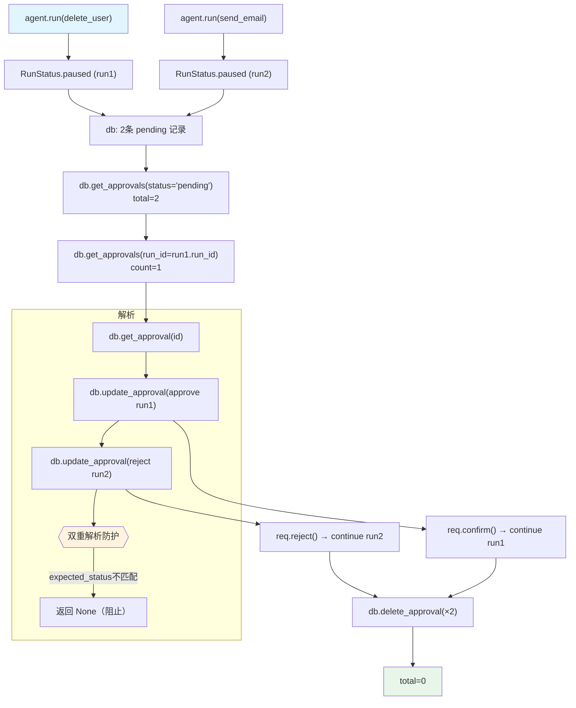

# approval_list_and_resolve.py — 实现原理分析

> 源文件：`cookbook/02_agents/11_approvals/approval_list_and_resolve.py`

## 概述

本示例展示 Agno 审批系统的**完整生命周期管理**：触发多个审批暂停、列表查询、按 run_id 过滤、按 ID 查询单条、批准/拒绝、防重复解析（乐观锁）、删除记录，演示全套 DB CRUD 操作。

**核心配置一览：**

| 配置项 | 值 | 说明 |
|--------|------|------|
| `name` | `"Admin Agent"` | Agent 名称 |
| `model` | `OpenAIResponses(id="gpt-5-mini")` | Responses API |
| `tools` | `[delete_user_data, send_bulk_email]` | 两个独立的 @approval 工具 |
| `markdown` | `True` | Markdown 格式 |
| `db` | `SqliteDb(approvals_table="approvals")` | 审批记录持久化 |

## 架构分层

```
用户代码层                          审批 CRUD 层
┌──────────────────────────┐      ┌─────────────────────────────────────┐
│ approval_list_and_       │      │ 两个独立暂停会话                     │
│ resolve.py               │      │  run1 = agent.run(delete...)         │
│                          │      │  run2 = agent.run(send_bulk...)      │
│ run1 = agent.run(...)    │─────>│  各自创建 pending 审批记录           │
│ run2 = agent.run(...)    │      │                                      │
│                          │      │ SqliteDb 审批 CRUD:                  │
│ db.get_approvals(...)    │      │  get_approvals(status/run_id/type)   │
│ db.get_approval(id)      │      │  get_approval(id)                    │
│ db.update_approval(...)  │      │  update_approval(expected_status=)   │
│ db.delete_approval(...)  │      │  delete_approval(id)                 │
└──────────────────────────┘      └─────────────────────────────────────┘
```

## 核心组件解析

### 审批 DB CRUD 完整 API

```python
# 列出所有 pending 审批
approvals_list, total = db.get_approvals(status="pending")

# 按 run_id 过滤
filtered, count = db.get_approvals(run_id=run1.run_id)

# 按 ID 获取单条
single = db.get_approval(approval_id)

# 乐观锁解析（防止并发重复解析）
resolved = db.update_approval(
    approval_id,
    expected_status="pending",  # 只有当前状态是 pending 才更新
    status="approved",          # 或 "rejected"
    resolved_by="admin@example.com",
    resolved_at=int(time.time()),
)
# resolved 为 None 表示 expected_status 不匹配（防重复解析）

# 获取 pending 数量
count = db.get_pending_approval_count()

# 删除记录
deleted = db.delete_approval(approval_id)

# 获取全部（不过滤）
all_approvals, all_total = db.get_approvals()
```

### 多工具独立审批

```python
@approval
@tool(requires_confirmation=True)
def delete_user_data(user_id: str) -> str: ...

@approval
@tool(requires_confirmation=True)
def send_bulk_email(subject: str, recipient_count: int) -> str: ...

# 两次调用各自独立触发审批
run1 = agent.run("Delete all data for user U-12345")  # → run1 暂停
run2 = agent.run("Send a bulk email...")               # → run2 暂停
# DB 中有 2 条 pending 记录
```

### 批准 vs 拒绝

```python
# 批准 → 工具实际执行
for req in run1.active_requirements:
    if req.needs_confirmation:
        req.confirm()
result1 = agent.continue_run(run_id=run1.run_id, requirements=run1.requirements)

# 拒绝 → 工具不执行，Agent 收到拒绝消息
for req in run2.active_requirements:
    if req.needs_confirmation:
        req.reject("Rejected by admin: too many recipients")
result2 = agent.continue_run(run_id=run2.run_id, requirements=run2.requirements)
```

### 乐观锁防双重解析

```python
# 第一次解析（成功）
resolved = db.update_approval(id, expected_status="pending", status="approved", ...)
assert resolved is not None  # 成功

# 第二次解析同一条（失败，状态已变 "approved"）
double = db.update_approval(id, expected_status="pending", status="rejected", ...)
assert double is None  # 乐观锁阻止了双重解析
```

## System Prompt 组装

| 序号 | 组成部分 | 值 | 是否生效 |
|------|---------|-----|---------|
| 3.2.4 | `add_name_to_context` | "Admin Agent" | 是 |
| 3.2.1 | `markdown` | `True` | 是 |
| 其他 | 均未设置 | - | 否 |

### 最终 System Prompt

```text
Your name is: Admin Agent
Respond using markdown.
```

## Mermaid 流程图



## 关键源码文件索引

| 文件 | 关键函数/类 | 作用 |
|------|------------|------|
| `agno/db/sqlite/` | `get_approvals(status, run_id, approval_type)` | 多维度查询 |
| `agno/db/sqlite/` | `update_approval(expected_status=)` | 乐观锁解析 |
| `agno/db/sqlite/` | `delete_approval()` | 记录删除 |
| `agno/approval/__init__.py` | `approval` | 审批装饰器 |
