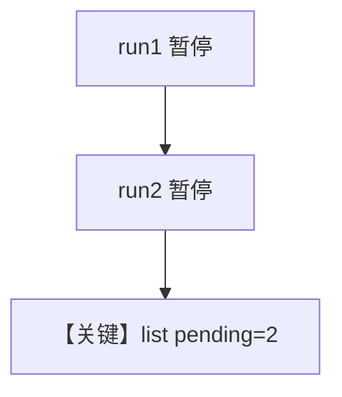

# approval_list_and_resolve.py — 实现原理分析

<!-- cookbook-py-source:start -->
## 完整源码

```python
"""
Approval List And Resolve
=============================

Full approval lifecycle: pause, list, filter, resolve, delete.
"""

import os
import time

from agno.agent import Agent
from agno.approval import approval
from agno.db.sqlite import SqliteDb
from agno.models.openai import OpenAIResponses
from agno.tools import tool

DB_FILE = "tmp/approvals_lifecycle_test.db"


@approval
@tool(requires_confirmation=True)
def delete_user_data(user_id: str) -> str:
    """Permanently delete all data for a user. This is irreversible.

    Args:
        user_id (str): The user ID whose data should be deleted.
    """
    return f"All data for user {user_id} has been permanently deleted."


@approval
@tool(requires_confirmation=True)
def send_bulk_email(subject: str, recipient_count: int) -> str:
    """Send a bulk email to many recipients.

    Args:
        subject (str): Email subject.
        recipient_count (int): Number of recipients.
    """
    return f"Bulk email '{subject}' sent to {recipient_count} recipients."


# ---------------------------------------------------------------------------
# Create Agent
# ---------------------------------------------------------------------------
db = SqliteDb(
    db_file=DB_FILE, session_table="agent_sessions", approvals_table="approvals"
)
agent = Agent(
    name="Admin Agent",
    model=OpenAIResponses(id="gpt-5-mini"),
    tools=[delete_user_data, send_bulk_email],
    markdown=True,
    db=db,
)

# ---------------------------------------------------------------------------
# Run Agent
# ---------------------------------------------------------------------------
if __name__ == "__main__":
    # Clean up from previous runs
    if os.path.exists(DB_FILE):
        os.remove(DB_FILE)
    os.makedirs("tmp", exist_ok=True)

    # Re-create after cleanup
    db = SqliteDb(
        db_file=DB_FILE, session_table="agent_sessions", approvals_table="approvals"
    )
    agent = Agent(
        name="Admin Agent",
        model=OpenAIResponses(id="gpt-5-mini"),
        tools=[delete_user_data, send_bulk_email],
        markdown=True,
        db=db,
    )

    # === Scenario 1: Trigger a pause and approval ===
    print("=== Scenario 1: Delete user data (triggers approval) ===")
    run1 = agent.run("Delete all data for user U-12345")
    assert run1.is_paused, f"Expected pause, got {run1.status}"
    print(f"Agent paused. Run ID: {run1.run_id}")

    # === Scenario 2: Trigger another pause ===
    print("\n=== Scenario 2: Send bulk email (triggers approval) ===")
    run2 = agent.run("Send a bulk email with subject 'Holiday Sale' to 5000 recipients")
    assert run2.is_paused, f"Expected pause, got {run2.status}"
    print(f"Agent paused. Run ID: {run2.run_id}")

    # === List all pending approvals ===
    print("\n=== Listing all pending approvals ===")
    approvals_list, total = db.get_approvals(status="pending")
    print(f"Total pending: {total}")
    assert total == 2, f"Expected 2 pending approvals, got {total}"
    for a in approvals_list:
        print(
            f"  [{a['id'][:8]}...] run={a['run_id'][:8]}... context={a.get('context')}"
        )

    # === Get count ===
    print("\n=== Pending approval count ===")
    count = db.get_pending_approval_count()
    print(f"Count: {count}")
    assert count == 2

    # === Filter by run_id ===
    print(f"\n=== Filter by run_id: {run1.run_id[:8]}... ===")
    filtered, filtered_total = db.get_approvals(run_id=run1.run_id)
    print(f"Found: {filtered_total}")
    assert filtered_total == 1
    approval1 = filtered[0]

    # === Get single approval ===
    print(f"\n=== Get approval by ID: {approval1['id'][:8]}... ===")
    single = db.get_approval(approval1["id"])
    assert single is not None
    print(f"  Status: {single['status']}")
    print(f"  Source: {single['source_type']}")

    # === Resolve first approval (approve) ===
    print("\n=== Resolving first approval (approve) ===")
    resolved = db.update_approval(
        approval1["id"],
        expected_status="pending",
        status="approved",
        resolved_by="admin@example.com",
        resolved_at=int(time.time()),
    )
    assert resolved is not None
    assert resolved["status"] == "approved"
    print(f"  Status: {resolved['status']}")
    print(f"  Resolved by: {resolved['resolved_by']}")

    # === Try to double-resolve (should fail due to expected_status guard) ===
    print("\n=== Attempting double-resolve (should fail) ===")
    double = db.update_approval(
        approval1["id"],
        expected_status="pending",
        status="rejected",
        resolved_by="hacker",
    )
    assert double is None, "Double-resolve should return None"
    print("  Double-resolve correctly blocked (expected_status guard)")

    # === Resolve second approval (reject) ===
    print("\n=== Resolving second approval (reject) ===")
    approvals2, _ = db.get_approvals(status="pending")
    assert len(approvals2) == 1
    approval2 = approvals2[0]
    resolved2 = db.update_approval(
        approval2["id"],
        expected_status="pending",
        status="rejected",
        resolved_by="admin@example.com",
        resolved_at=int(time.time()),
    )
    assert resolved2 is not None
    assert resolved2["status"] == "rejected"
    print(f"  Status: {resolved2['status']}")

    # === Verify clean state ===
    print("\n=== Final state ===")
    final_count = db.get_pending_approval_count()
    print(f"Pending approvals: {final_count}")
    assert final_count == 0

    all_approvals, all_total = db.get_approvals()
    print(f"Total approvals: {all_total}")
    assert all_total == 2

    # === Continue the runs ===
    print("\n=== Continuing run 1 (approved) ===")
    for req in run1.active_requirements:
        if req.needs_confirmation:
            req.confirm()
    result1 = agent.continue_run(run_id=run1.run_id, requirements=run1.requirements)
    print(f"  Result: {str(result1.content)[:100]}...")

    print("\n=== Continuing run 2 (rejected) ===")
    for req in run2.active_requirements:
        if req.needs_confirmation:
            req.reject("Rejected by admin: too many recipients")
    result2 = agent.continue_run(run_id=run2.run_id, requirements=run2.requirements)
    print(f"  Result: {str(result2.content)[:100]}...")

    # === Delete approvals ===
    print("\n=== Deleting approval records ===")
    for a in all_approvals:
        deleted = db.delete_approval(a["id"])
        assert deleted, f"Failed to delete approval {a['id']}"
        print(f"  Deleted: {a['id'][:8]}...")

    final_all, final_total = db.get_approvals()
    assert final_total == 0
    print(f"All approvals deleted. Total: {final_total}")

    print("\n--- All checks passed! ---")
```

<!-- cookbook-py-source:end -->

> 源文件：`cookbook/02_agents/11_approvals/approval_list_and_resolve.py`

## 概述

本示例展示 **多工具、多 run 的审批生命周期**：`delete_user_data` 与 `send_bulk_email` 各触发一次暂停，`get_approvals` 列出两条 pending，后续演示过滤、resolve、delete 等 DB API（见脚本后半）。

**核心配置一览：**

| 配置项 | 值 |
|--------|-----|
| `name` | `"Admin Agent"` |
| `tools` | 两个 `@approval` + `requires_confirmation` 工具 |

## 运行机制与因果链

运维/控制台场景：**批量审阅** 再批量放行。

## Mermaid 流程图


```mermaid
flowchart TD
    R1["run1 暂停"] --> R2["run2 暂停"]
    R2 --> L["【关键】list pending=2"]
```

## 关键源码文件索引

| 文件 | 作用 |
|------|------|
| `agno/db/sqlite` | `get_approvals` 过滤与删除 |
