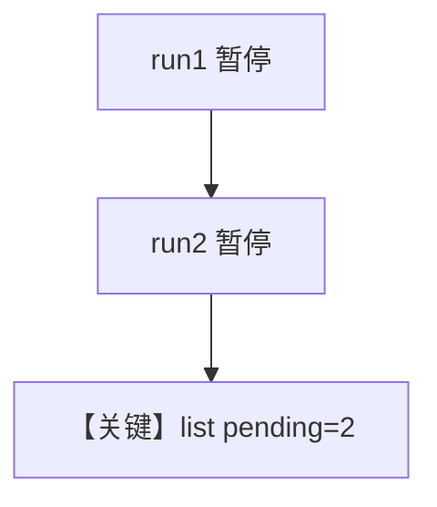

# approval_list_and_resolve.py — 实现原理分析

> 源文件：`cookbook/02_agents/11_approvals/approval_list_and_resolve.py`

## 概述

本示例展示 **多工具、多 run 的审批生命周期**：`delete_user_data` 与 `send_bulk_email` 各触发一次暂停，`get_approvals` 列出两条 pending，后续演示过滤、resolve、delete 等 DB API（见脚本后半）。

**核心配置一览：**

| 配置项 | 值 |
|--------|-----|
| `name` | `"Admin Agent"` |
| `tools` | 两个 `@approval` + `requires_confirmation` 工具 |

## 运行机制与因果链

运维/控制台场景：**批量审阅** 再批量放行。

## Mermaid 流程图

```mermaid
flowchart TD
    R1["run1 暂停"] --> R2["run2 暂停"]
    R2 --> L["【关键】list pending=2"]
```

## 关键源码文件索引

| 文件 | 作用 |
|------|------|
| `agno/db/sqlite` | `get_approvals` 过滤与删除 |
