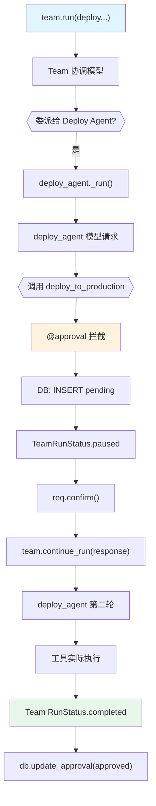

# approval_team.py — 实现原理分析

> 源文件：`cookbook/02_agents/11_approvals/approval_team.py`

## 概述

本示例展示 Agno 的 **Team 级别审批**机制：`@approval` 装饰器不仅适用于单 Agent，也能透明地与 `Team` 配合工作，当成员 Agent 的工具触发审批时，Team 的 `run_response.is_paused` 同样为 `True`，通过 `team.continue_run(response)` 恢复执行。

**核心配置一览：**

| 配置项 | 值 | 说明 |
|--------|------|------|
| `deploy_agent.name` | `"Deploy Agent"` | 成员 Agent 名称 |
| `deploy_agent.model` | `OpenAIResponses(id="gpt-5-mini")` | 成员 Agent 模型 |
| `deploy_agent.tools` | `[deploy_to_production]` | @approval + requires_confirmation |
| `team.name` | `"DevOps Team"` | Team 名称 |
| `team.model` | `OpenAIResponses(id="gpt-5-mini")` | Team 协调模型 |
| `team.db` | `SqliteDb(session_table="team_sessions", approvals_table="approvals")` | 审批 + 会话 DB |

## 架构分层

```
用户代码层                     Team 层              成员 Agent 层
┌──────────────┐    ┌──────────────────┐    ┌──────────────────────┐
│ approval_    │    │ Team._run()      │    │ deploy_agent._run()  │
│ team.py      │    │  ├─ 协调模型决策  │    │  ├─ 模型请求         │
│              │    │  └─ 委派给       │───>│  ├─ 工具调用         │
│ team.run()   │───>│    deploy_agent  │    │  ├─ @approval 拦截   │
│ response.    │    │                  │    │  │   → DB pending    │
│   is_paused  │    │ team.continue_  │<───│  └─ RunStatus.paused │
│ team.        │    │   run(response)  │    └──────────────────────┘
│ continue_    │    │  └─ 恢复执行     │
│ run(response)│    └──────────────────┘
└──────────────┘
                                              ▼
                                  ┌──────────────────────┐
                                  │ OpenAIResponses      │
                                  │ gpt-5-mini (×2)      │
                                  │ Team + Member        │
                                  └──────────────────────┘
```

## 核心组件解析

### Team 审批与 Agent 审批的差异

```python
# Agent 版（approval_basic.py）
run_response = agent.run(...)
run_response = agent.continue_run(
    run_id=run_response.run_id,
    requirements=run_response.requirements,
)

# Team 版 - continue_run 接收整个 response 对象
response = team.run("Deploy the payments app version 2.1 to production")
response = team.continue_run(response)  # 注意：参数是 response 对象而非 run_id
```

### Team DB 配置（会话 + 审批共用一个 DB）

```python
db = SqliteDb(
    db_file="tmp/approvals_team_test.db",
    session_table="team_sessions",     # Team 会话表
    approvals_table="approvals",        # 审批记录表（成员工具触发）
)

team = Team(
    name="DevOps Team",
    members=[deploy_agent],
    model=OpenAIResponses(id="gpt-5-mini"),
    db=db,  # db 附加到 Team，审批记录同步写入
)
```

### 审批记录的 source 字段

当 Team 成员的工具触发审批时，DB 记录的 `source_type` / `source_name` 会反映成员信息：

```python
approval_record = approvals_list[0]
print(approval_record['source_type'])  # e.g., "agent"
print(approval_record['source_name'])  # e.g., "Deploy Agent"
print(approval_record['context'])      # 工具调用上下文
```

## System Prompt 组装

Team 协调层和成员 Agent 各有独立的 system prompt：

**Team 协调层（DevOps Team）：**
```text
Your name is: DevOps Team
```

**成员 deploy_agent：**
```text
Your role is: Handles deployments to production
```

## 完整 API 请求

```python
# 第一轮：Team 协调模型决定委派给 deploy_agent
client.responses.create(
    model="gpt-5-mini",
    input=[
        {"role": "developer", "content": "Your name is: DevOps Team\n..."},
        {"role": "user", "content": "Deploy the payments app version 2.1 to production"}
    ],
    tools=[{"type": "function", "name": "transfer_to_Deploy_Agent", ...}],
    ...
)

# 第二轮：deploy_agent 调用 deploy_to_production → @approval 暂停
client.responses.create(
    model="gpt-5-mini",
    input=[
        {"role": "developer", "content": "Your role is: Handles deployments to production"},
        {"role": "user", "content": "Deploy the payments app version 2.1..."}
    ],
    tools=[{"type": "function", "name": "deploy_to_production", ...}],
    ...
)
# → RunStatus.paused
```

## Mermaid 流程图



## 关键源码文件索引

| 文件 | 关键函数/类 | 作用 |
|------|------------|------|
| `agno/team/team.py` | `Team._run()` | Team 运行入口 |
| `agno/team/team.py` | `Team.continue_run()` | Team 级别恢复 |
| `agno/approval/__init__.py` | `approval` | 审批装饰器 |
| `agno/db/sqlite/` | `SqliteDb` | Team + 审批共享 DB |
