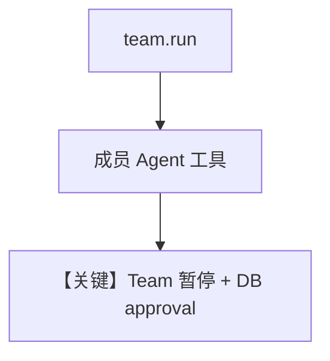

# approval_team.py — 实现原理分析

> 源文件：`cookbook/02_agents/11_approvals/approval_team.py`

## 概述

本示例展示 **Team 层审批**：成员 Agent 持有 `@approval` 工具，`Team.run` 在成员调用需确认工具时 **整体暂停**，`approvals` 仍落在共享 `db`（`team_sessions`）。

**核心配置一览：**

| 配置项 | 值 |
|--------|-----|
| `Team` | `members=[deploy_agent]`，`db=db` |
| `deploy_agent` | `tools=[deploy_to_production]`，`@approval` + `requires_confirmation` |

## 运行机制与因果链

编排器模型决定何时调用成员；成员工具触发审批时 **run 级暂停**。

## System Prompt 组装

Team 与成员各有消息构造路径（`team/_messages.py`）；本示例重点在 **审批** 非 prompt。

## Mermaid 流程图

```mermaid
flowchart TD
    T["team.run"] --> M["成员 Agent 工具"]
    M --> P["【关键】Team 暂停 + DB approval"]
```

## 关键源码文件索引

| 文件 | 作用 |
|------|------|
| `agno/team/team.py` | `Team.run`；`get_approvals` 集成 |
