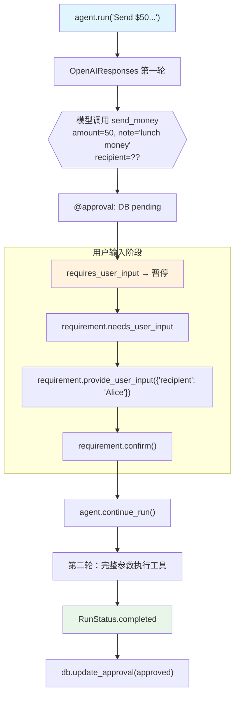

# approval_user_input.py — 实现原理分析

> 源文件：`cookbook/02_agents/11_approvals/approval_user_input.py`

## 概述

本示例展示 Agno 的 **`@approval` + 用户输入**机制：通过 `@tool(requires_user_input=True, user_input_fields=["recipient"])` 让模型在调用工具时省略某些敏感字段，由用户在审批阶段补充填入，确保敏感信息不经过 LLM。

**核心配置一览：**

| 配置项 | 值 | 说明 |
|--------|------|------|
| `model` | `OpenAIResponses(id="gpt-5-mini")` | Responses API |
| `tools` | `[send_money]` | requires_user_input + user_input_fields |
| `markdown` | `True` | Markdown 格式 |
| `db` | `SqliteDb(approvals_table="approvals")` | 审批记录持久化 |

## 架构分层

```
用户代码层                          用户输入注入层
┌──────────────────────────┐      ┌─────────────────────────────────────┐
│ approval_user_input.py   │      │ Agent._run()                         │
│                          │      │  ├─ 模型请求工具调用                  │
│ @approval                │      │  │   模型只传 amount + note           │
│ @tool(requires_user_     │─────>│  │   (recipient 为空/占位)            │
│   input=True,            │      │  ├─ @approval: DB 写入 pending        │
│   user_input_fields=     │      │  ├─ requires_user_input → 暂停       │
│   ["recipient"])         │      │  └─ 返回 RunStatus.paused            │
│                          │      │                                      │
│ req.provide_user_input(  │      │ 用户提供输入                          │
│   {"recipient": "Alice"} │      │  └─ 注入到工具参数                    │
│ )                        │      │                                      │
│ req.confirm()            │      │ agent.continue_run()                 │
│ agent.continue_run()     │      │  └─ 工具以完整参数执行                │
└──────────────────────────┘      └─────────────────────────────────────┘
```

## 核心组件解析

### user_input_fields 机制

```python
@approval
@tool(requires_user_input=True, user_input_fields=["recipient"])
def send_money(amount: float, recipient: str, note: str) -> str:
    """Send money to a recipient.

    Args:
        recipient: The recipient to send money to (provided by user).
    """
    return f"Sent ${amount} to {recipient}: {note}"
```

- `amount` 和 `note`：由 LLM 从用户消息中推断填入
- `recipient`：被列为 `user_input_fields`，LLM **不负责填写**，由用户在暂停时提供

### 用户输入 + 确认双重操作

```python
for requirement in run_response.active_requirements:
    # 1. 提供用户输入（填充 user_input_fields 中的字段）
    if requirement.needs_user_input:
        requirement.provide_user_input({"recipient": "Alice"})
    
    # 2. 确认执行（因为同时有 requires_confirmation 语义）
    if requirement.needs_confirmation:
        requirement.confirm()
```

### DB 审批记录（approval_type="required"）

```python
# user_input 类型也记录为 "required" 类型
approvals_list, total = db.get_approvals(
    status="pending",
    approval_type="required"
)
```

## System Prompt 组装

| 序号 | 组成部分 | 值 | 是否生效 |
|------|---------|-----|---------|
| 3.2.1 | `markdown` | `True` | 是 |
| 其他 | 均未设置 | - | 否 |

### 最终 System Prompt

```text
Respond using markdown.
```

## 完整 API 请求

```python
# 第一轮：模型调用工具（不传 recipient）
client.responses.create(
    model="gpt-5-mini",
    input=[
        {"role": "developer", "content": "Respond using markdown."},
        {"role": "user", "content": "Send $50 to someone with the note 'lunch money'."}
    ],
    tools=[{
        "type": "function",
        "name": "send_money",
        "parameters": {
            "properties": {
                "amount": {"type": "number"},
                "recipient": {"type": "string"},  # 模型可能填 "" 或占位值
                "note": {"type": "string"}
            }
        }
    }],
    stream=True
)
# → requires_user_input 暂停，用户提供 recipient="Alice"

# 第二轮（provide_user_input + confirm 后）
client.responses.create(
    model="gpt-5-mini",
    input=[
        {"role": "developer", "content": "Respond using markdown."},
        {"role": "user", "content": "Send $50 to someone with the note 'lunch money'."},
        {"role": "assistant", "tool_calls": [{"name": "send_money", "arguments": {"amount": 50, "recipient": "Alice", "note": "lunch money"}}]},
        {"role": "tool", "content": "Sent $50 to Alice: lunch money"}
    ],
    ...
)
```

## Mermaid 流程图



## 关键源码文件索引

| 文件 | 关键函数/类 | 作用 |
|------|------------|------|
| `agno/approval/__init__.py` | `approval` | 审批装饰器 |
| `agno/tools/__init__.py` | `tool(requires_user_input, user_input_fields)` | 用户输入字段声明 |
| `agno/agent/agent.py` | `continue_run()` | 恢复执行 |
