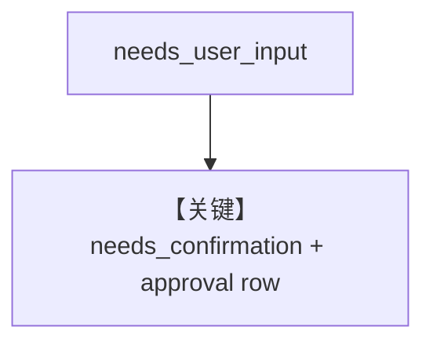

# approval_user_input.py — 实现原理分析

> 源文件：`cookbook/02_agents/11_approvals/approval_user_input.py`

## 概述

本示例展示 **`@approval` + `requires_user_input`**：`send_money` 需人工填 `recipient` 且进入审批表；步骤上先处理 **user_input_schema**，再 **confirm** 审批。

**核心配置一览：**

| 装饰器 | `@approval` + `@tool(requires_user_input=True, user_input_fields=["recipient"])` |

## 运行机制与因果链

双重 HITL：**字段级输入** + **合规审批**。

## Mermaid 流程图

```mermaid
flowchart TD
    U["needs_user_input"] --> A["【关键】needs_confirmation + approval row"]
```

## 关键源码文件索引

| 文件 | 作用 |
|------|------|
| `agno/run` | `active_requirements` 多类型并存 |
