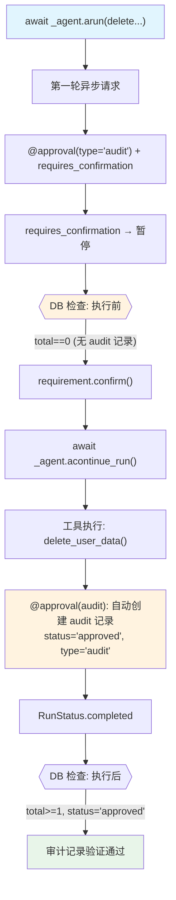

# audit_approval_async.py — 实现原理分析

> 源文件：`cookbook/02_agents/11_approvals/audit_approval_async.py`

## 概述

本示例展示 Agno 的 **`@approval(type="audit")` 异步审计审批**机制：audit 类型在工具**执行后**创建审计记录，而非执行前创建 pending 记录。本示例是 `audit_approval_confirmation.py` 的异步版，使用 `arun()` 和 `acontinue_run()`。

**核心配置一览：**

| 配置项 | 值 | 说明 |
|--------|------|------|
| `model` | `OpenAIResponses(id="gpt-5-mini")` | Responses API |
| `tools` | `[delete_user_data]` | @approval(type="audit") + requires_confirmation |
| `markdown` | `True` | Markdown 格式 |
| `db` | `SqliteDb(approvals_table="approvals")` | 审计记录持久化 |

## 核心组件解析

### audit 类型 vs 默认类型的时序差异

| 特性 | `@approval`（默认 type="required"） | `@approval(type="audit")` |
|------|-------------------------------------|---------------------------|
| DB 记录创建时机 | 工具执行**前**（pending） | 工具执行**后**（approved/rejected） |
| 执行前 DB 查询 | 有 pending 记录 | **无记录** |
| 执行后 DB 查询 | 需要手动 update_approval | **自动创建** approved/rejected 记录 |
| 用途 | 工具执行前审批 | 操作后审计追踪 |

```python
@approval(type="audit")         # 审计模式：执行后记录
@tool(requires_confirmation=True)  # 仍需人工确认才能执行
def delete_user_data(user_id: str) -> str:
    return f"Deleted data for user {user_id}"
```

### 异步 audit 流程

```python
# Step 1: 异步运行 - 暂停（因 requires_confirmation）
run_response = await _agent.arun("Delete all data for user U-99887.")
assert run_response.is_paused

# Step 2: 验证执行前无 audit 记录
approvals_list, total = _db.get_approvals()
assert total == 0  # audit 模式：执行前没有记录

# Step 3: 确认并异步继续
for requirement in run_response.active_requirements:
    if requirement.needs_confirmation:
        requirement.confirm()
run_response = await _agent.acontinue_run(
    run_id=run_response.run_id,
    requirements=run_response.requirements,
)

# Step 4: 验证执行后的 audit 记录（自动创建）
approvals_list, total = _db.get_approvals(approval_type="audit")
assert total >= 1
assert approvals_list[0]["status"] == "approved"
assert approvals_list[0]["approval_type"] == "audit"
```

## System Prompt 组装

```text
Respond using markdown.
```

## Mermaid 流程图



## 关键源码文件索引

| 文件 | 关键函数/类 | 作用 |
|------|------------|------|
| `agno/approval/__init__.py` | `approval(type="audit")` | 审计审批装饰器 |
| `agno/agent/agent.py` | `arun()`, `acontinue_run()` | 异步运行/恢复 |
