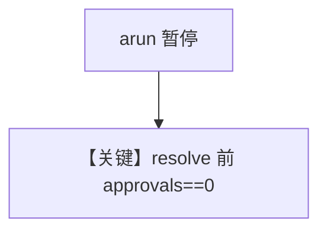

# audit_approval_async.py — 实现原理分析

> 源文件：`cookbook/02_agents/11_approvals/audit_approval_async.py`

## 概述

本示例展示 **异步 + audit 审批**：`@approval(type="audit")` 与 `delete_user_data`，在 **resolution 前** `get_approvals()` 总数为 0（与 required 型不同），异步 `arun` 驱动。

**核心配置一览：** `delete_user_data`；`OpenAIResponses`；`SqliteDb` + `approvals`。

## 运行机制与因果链

强调 **审计记录在动作完成/解析后才可追溯**（依脚本断言）。

## Mermaid 流程图

```mermaid
flowchart TD
    A["arun 暂停"] --> Z["【关键】resolve 前 approvals==0"]
```

## 关键源码文件索引

| 文件 | 作用 |
|------|------|
| `agno/db` | `get_approvals` 时序 |
