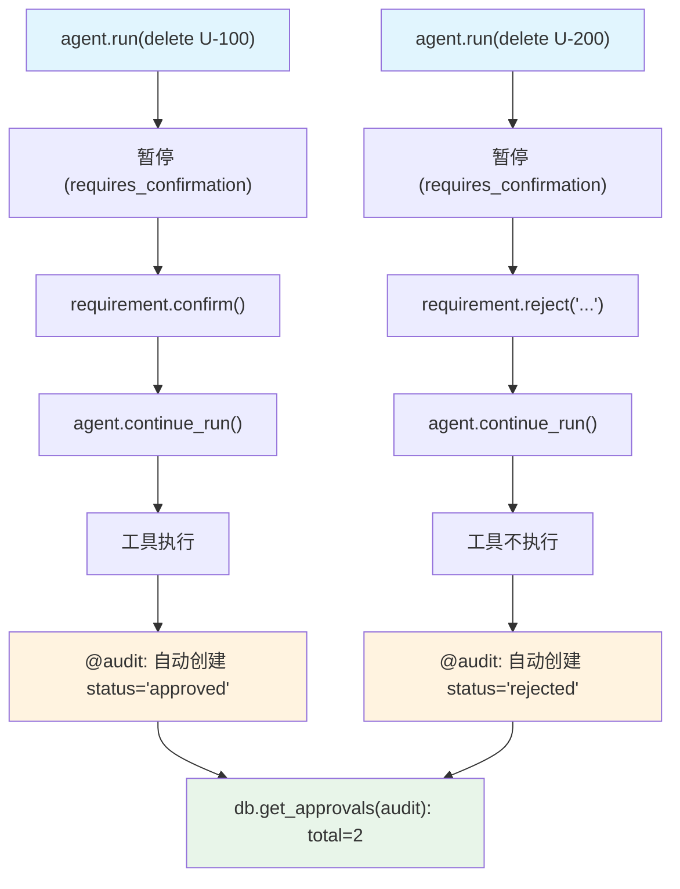

# audit_approval_confirmation.py — 实现原理分析

> 源文件：`cookbook/02_agents/11_approvals/audit_approval_confirmation.py`

## 概述

本示例展示 Agno **`@approval(type="audit")` 审计审批**的批准和拒绝两条路径：audit 类型在工具执行后自动创建审计 DB 记录，记录结果为 `approved`（批准时）或 `rejected`（拒绝时），无需手动调用 `db.update_approval()`。

**核心配置一览：**

| 配置项 | 值 | 说明 |
|--------|------|------|
| `model` | `OpenAIResponses(id="gpt-5-mini")` | Responses API |
| `tools` | `[delete_user_data]` | @approval(type="audit") + requires_confirmation |
| `markdown` | `True` | Markdown 格式 |
| `db` | `SqliteDb(approvals_table="approvals")` | 审计记录持久化 |

## 核心组件解析

### 批准路径 vs 拒绝路径

```python
# ===== 批准路径 =====
run_response = agent.run("Delete all data for user U-100.")
# 暂停...

for requirement in run_response.active_requirements:
    if requirement.needs_confirmation:
        requirement.confirm()  # 批准

run_response = agent.continue_run(...)
# 工具执行 → audit 记录自动创建 status="approved"

approvals_list, total = db.get_approvals(approval_type="audit")
assert approvals_list[0]["status"] == "approved"

# ===== 拒绝路径 =====
run_response = agent.run("Delete all data for user U-200.")
# 暂停...

for requirement in run_response.active_requirements:
    if requirement.needs_confirmation:
        requirement.reject("Rejected by admin: not authorized")  # 拒绝

run_response = agent.continue_run(...)
# 工具不执行 → audit 记录自动创建 status="rejected"

approvals_list, total = db.get_approvals(approval_type="audit")
rejected = [a for a in approvals_list if a["status"] == "rejected"]
assert len(rejected) >= 1
```

### audit 类型的自动记录创建

与默认 `@approval` 不同，`@approval(type="audit")` 的 DB 记录特点：
- 无需手动调用 `db.update_approval()` 来更新状态
- 记录在 `continue_run()` 返回后**自动创建**，状态反映最终决策
- 拒绝时工具函数体不执行，但仍记录 `status="rejected"` 的审计条目

```python
# 最终总计 2 条 audit 记录（1 approved + 1 rejected）
all_logged, all_total = db.get_approvals(approval_type="audit")
assert all_total == 2
```

## System Prompt 组装

```text
Respond using markdown.
```

## Mermaid 流程图



## 关键源码文件索引

| 文件 | 关键函数/类 | 作用 |
|------|------------|------|
| `agno/approval/__init__.py` | `approval(type="audit")` | 审计模式 |
| `agno/agent/agent.py` | `continue_run()` | 恢复并触发自动审计记录 |
