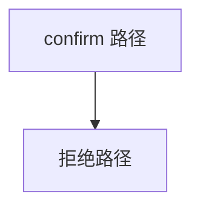

# audit_approval_confirmation.py — 实现原理分析

> 源文件：`cookbook/02_agents/11_approvals/audit_approval_confirmation.py`

## 概述

本示例展示 **audit 类型下的确认与拒绝路径**：`delete_user_data` 先走 **Part 1 批准**，再走 **Part 2 拒绝**（或对称场景，见 `.py` 后半），验证 DB 中 audit 记录与状态迁移。

**核心配置：** `@approval(type="audit")` + `requires_confirmation=True`。

## 运行机制与因果链

同一工具上 **批准/拒绝** 对审计行与 run 结束状态的影响。

## Mermaid 流程图

```mermaid
flowchart TD
    C["confirm 路径"] --> X["拒绝路径"]
```

## 关键源码文件索引

| 文件 | 作用 |
|------|------|
| `agno/run` | `requirement.reject` |
