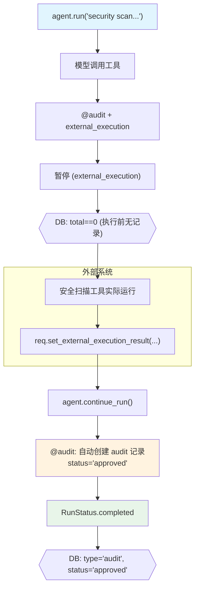

# audit_approval_external.py — 实现原理分析

> 源文件：`cookbook/02_agents/11_approvals/audit_approval_external.py`

## 概述

本示例展示 **`@approval(type="audit")` + `external_execution=True`** 的组合：外部系统执行工具，完成后自动创建审计记录，兼顾了外部执行的灵活性和事后审计的完整性。

**核心配置一览：**

| 配置项 | 值 | 说明 |
|--------|------|------|
| `model` | `OpenAIResponses(id="gpt-5-mini")` | Responses API |
| `tools` | `[run_security_scan]` | @approval(type="audit") + external_execution=True |
| `markdown` | `True` | Markdown 格式 |
| `db` | `SqliteDb(approvals_table="approvals")` | 审计记录持久化 |

## 核心组件解析

### 双重组合效果

```python
@approval(type="audit")       # 执行后自动创建 audit 记录
@tool(external_execution=True) # 工具函数体不执行，由外部系统提供结果
def run_security_scan(target: str) -> str:
    return f"Scan complete for {target}: no vulnerabilities found"  # 永远不执行
```

执行时序：
1. 模型决定调用工具 → `external_execution=True` → 暂停
2. **执行前**：DB 无记录（audit 模式）
3. 外部系统执行扫描
4. `requirement.set_external_execution_result(result)` 注入结果
5. `agent.continue_run()` 恢复
6. **执行后**：自动创建 `approval_type="audit"`, `status="approved"` 记录

### 时序验证

```python
# 执行前：无记录
run_response = agent.run("Run a security scan on the production server.")
approvals_list, total = db.get_approvals()
assert total == 0  # audit 模式，执行前无记录

# 注入外部结果
for requirement in run_response.active_requirements:
    if requirement.needs_external_execution:
        requirement.set_external_execution_result(
            "Scan complete: no vulnerabilities found"
        )
run_response = agent.continue_run(...)

# 执行后：自动创建 audit 记录
approvals_list, total = db.get_approvals(approval_type="audit")
assert total >= 1
assert approvals_list[0]["status"] == "approved"
assert approvals_list[0]["approval_type"] == "audit"
```

## Mermaid 流程图



## 关键源码文件索引

| 文件 | 关键函数/类 | 作用 |
|------|------------|------|
| `agno/approval/__init__.py` | `approval(type="audit")` | 审计装饰器 |
| `agno/tools/__init__.py` | `tool(external_execution=True)` | 外部执行标记 |
| `agno/agent/agent.py` | `continue_run()` | 注入外部结果并触发审计 |
