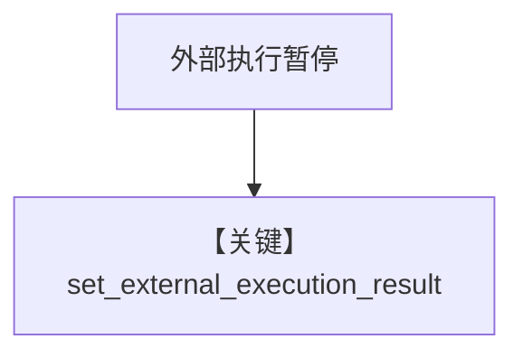

# audit_approval_external.py — 实现原理分析

> 源文件：`cookbook/02_agents/11_approvals/audit_approval_external.py`

## 概述

本示例展示 **`@approval(type="audit")` + `external_execution=True`**：`run_security_scan` 暂停后先 **无审批行**（与脚本断言一致），再 `set_external_execution_result` 继续。

**核心配置：** `run_security_scan` 装饰器组合。

## 运行机制与因果链

外部扫描结果回传与 **审计日志** 的先后关系。

## Mermaid 流程图

```mermaid
flowchart TD
    P["外部执行暂停"] --> S["【关键】set_external_execution_result"]
```

## 关键源码文件索引

| 文件 | 作用 |
|------|------|
| `agno/approval` | audit + external |
