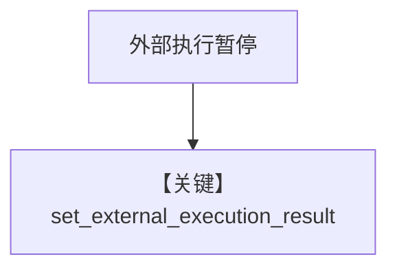

# audit_approval_external.py — 实现原理分析

<!-- cookbook-py-source:start -->
## 完整源码

```python
"""
Audit Approval External
=============================

Audit approval with external execution: @approval(type="audit") + @tool(external_execution=True).
"""

import os

from agno.agent import Agent
from agno.approval import approval
from agno.db.sqlite import SqliteDb
from agno.models.openai import OpenAIResponses
from agno.tools import tool

DB_FILE = "tmp/approvals_test.db"


@approval(type="audit")
@tool(external_execution=True)
def run_security_scan(target: str) -> str:
    """Run a security scan against a target system.

    Args:
        target (str): The target to scan.

    Returns:
        str: Scan results.
    """
    return f"Scan complete for {target}: no vulnerabilities found"


# ---------------------------------------------------------------------------
# Create Agent
# ---------------------------------------------------------------------------
db = SqliteDb(
    db_file=DB_FILE, session_table="agent_sessions", approvals_table="approvals"
)
agent = Agent(
    model=OpenAIResponses(id="gpt-5-mini"),
    tools=[run_security_scan],
    markdown=True,
    db=db,
)

# ---------------------------------------------------------------------------
# Run Agent
# ---------------------------------------------------------------------------
if __name__ == "__main__":
    # Clean up from previous runs
    if os.path.exists(DB_FILE):
        os.remove(DB_FILE)
    os.makedirs("tmp", exist_ok=True)

    # Re-create after cleanup
    db = SqliteDb(
        db_file=DB_FILE, session_table="agent_sessions", approvals_table="approvals"
    )
    agent = Agent(
        model=OpenAIResponses(id="gpt-5-mini"),
        tools=[run_security_scan],
        markdown=True,
        db=db,
    )

    # Step 1: Run - agent will pause because the tool requires external execution
    print("--- Step 1: Running agent (expects pause for external execution) ---")
    run_response = agent.run("Run a security scan on the production server.")
    print(f"Run status: {run_response.status}")
    assert run_response.is_paused, f"Expected paused, got {run_response.status}"
    print("Agent paused as expected.")

    # Step 2: Verify no approval record yet (logged approvals are created after resolution)
    print("\n--- Step 2: Verifying no approval records yet ---")
    approvals_list, total = db.get_approvals()
    print(f"Total approvals before resolution: {total}")
    assert total == 0, f"Expected 0 approvals before resolution, got {total}"
    print("No approval records yet (as expected for audit approval).")

    # Step 3: Provide external execution result and continue
    print("\n--- Step 3: Setting external result and continuing ---")
    for requirement in run_response.active_requirements:
        if requirement.needs_external_execution:
            print(f"  Setting result for tool: {requirement.tool_execution.tool_name}")
            requirement.set_external_execution_result(
                "Scan complete: no vulnerabilities found"
            )

    run_response = agent.continue_run(
        run_id=run_response.run_id,
        requirements=run_response.requirements,
    )
    print(f"Run status after continue: {run_response.status}")
    assert not run_response.is_paused, "Expected run to complete, but it's still paused"

    # Step 4: Verify logged approval record was created in DB
    print("\n--- Step 4: Verifying logged approval record in DB ---")
    approvals_list, total = db.get_approvals(approval_type="audit")
    print(f"Logged approvals: {total}")
    assert total >= 1, f"Expected at least 1 logged approval, got {total}"
    approval_record = approvals_list[0]
    print(f"  Approval ID:    {approval_record['id']}")
    print(f"  Status:         {approval_record['status']}")
    print(f"  Approval type:  {approval_record['approval_type']}")
    print(f"  Source:         {approval_record['source_type']}")
    assert approval_record["status"] == "approved", (
        f"Expected status 'approved', got {approval_record['status']}"
    )
    assert approval_record["approval_type"] == "audit", (
        f"Expected type 'audit', got {approval_record['approval_type']}"
    )

    print("\n--- All checks passed! ---")
    print(f"\nAgent output (truncated): {str(run_response.content)[:200]}...")
```

<!-- cookbook-py-source:end -->

> 源文件：`cookbook/02_agents/11_approvals/audit_approval_external.py`

## 概述

本示例展示 **`@approval(type="audit")` + `external_execution=True`**：`run_security_scan` 暂停后先 **无审批行**（与脚本断言一致），再 `set_external_execution_result` 继续。

**核心配置：** `run_security_scan` 装饰器组合。

## 运行机制与因果链

外部扫描结果回传与 **审计日志** 的先后关系。

## Mermaid 流程图


```mermaid
flowchart TD
    P["外部执行暂停"] --> S["【关键】set_external_execution_result"]
```

## 关键源码文件索引

| 文件 | 作用 |
|------|------|
| `agno/approval` | audit + external |
