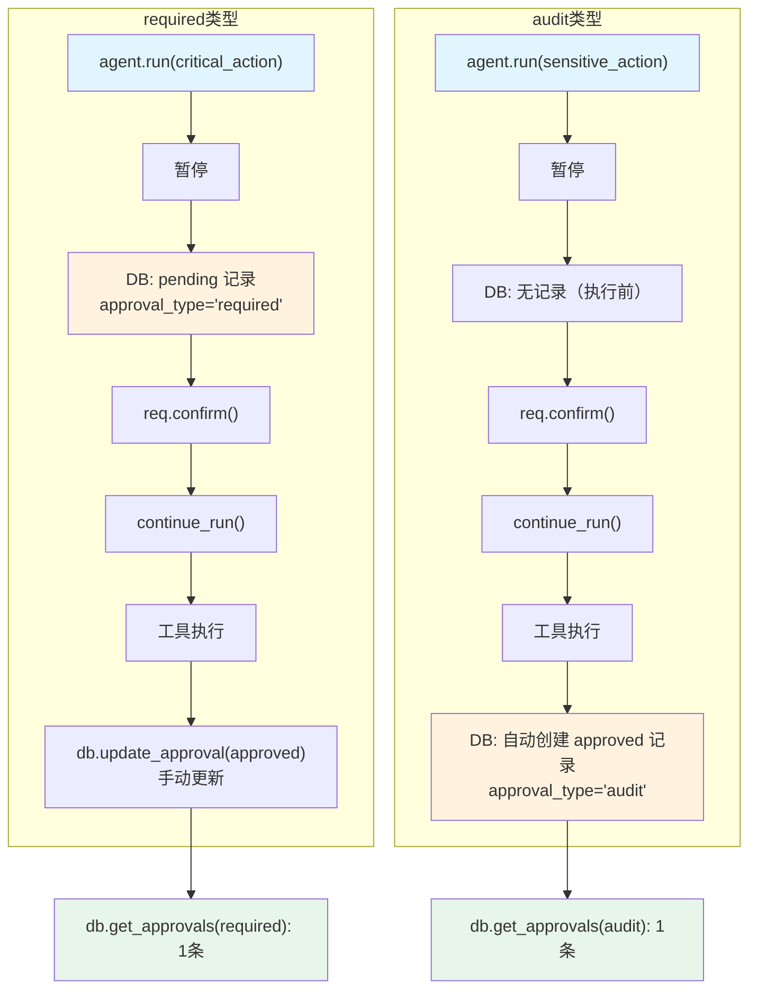

# audit_approval_overview.py — 实现原理分析

> 源文件：`cookbook/02_agents/11_approvals/audit_approval_overview.py`

## 概述

本示例通过**同一 Agent 同时注册两种审批类型**来对比展示 `@approval`（`type="required"` 预审批）和 `@approval(type="audit")`（事后审计）的完整差异：前者在执行前创建 `pending` 记录并需要外部解析，后者在执行后自动创建最终状态记录。

**核心配置一览：**

| 配置项 | 值 | 说明 |
|--------|------|------|
| `model` | `OpenAIResponses(id="gpt-5-mini")` | Responses API |
| `tools` | `[critical_action, sensitive_action]` | 两种审批类型并存 |
| `markdown` | `True` | Markdown 格式 |
| `db` | `SqliteDb(approvals_table="approvals")` | 审批+审计共用表 |

## 核心组件解析

### 两种审批类型对比

| 特性 | `@approval`（required） | `@approval(type="audit")` |
|------|-------------------------|---------------------------|
| 装饰工具 | `critical_action` | `sensitive_action` |
| DB 记录时机 | 执行**前**，`status="pending"` | 执行**后**，`status="approved"/"rejected"` |
| 需手动解析 | 是（`db.update_approval()`） | 否（自动创建最终状态） |
| 业务场景 | 高风险操作，需预先审批 | 合规审计，记录操作历史 |
| `approval_type` | `"required"` | `"audit"` |

```python
@approval                          # type="required"（默认）
@tool(requires_confirmation=True)
def critical_action(action: str) -> str: ...

@approval(type="audit")           # 事后审计
@tool(requires_confirmation=True)
def sensitive_action(action: str) -> str: ...
```

### 按 approval_type 分离查询

```python
# required 类型（预审批）
required_approvals, required_count = db.get_approvals(approval_type="required")
# → 1条，status 由 pending→approved（手动更新）

# audit 类型（事后审计）
logged_approvals, logged_count = db.get_approvals(approval_type="audit")
# → 1条，自动创建 status="approved"

# 两种类型各自独立：required_count=1, logged_count=1
```

### 完整对比流程

```python
# === required 类型：执行前有 pending 记录 ===
run1 = agent.run("Execute the critical action: deploy to production.")
required_approvals, _ = db.get_approvals(approval_type="required")
assert required_approvals[0]["status"] == "pending"  # 执行前 pending

for req in run1.active_requirements:
    req.confirm()
run1 = agent.continue_run(run_id=run1.run_id, requirements=run1.requirements)

db.update_approval(  # 必须手动更新
    required_approval["id"],
    expected_status="pending", status="approved", ...
)

# === audit 类型：执行后自动创建记录 ===
run2 = agent.run("Execute the sensitive action: export user reports.")
for req in run2.active_requirements:
    req.confirm()
run2 = agent.continue_run(run_id=run2.run_id, requirements=run2.requirements)

logged_approvals, _ = db.get_approvals(approval_type="audit")
assert logged_approvals[0]["status"] == "approved"  # 自动创建
```

## System Prompt 组装

```text
Respond using markdown.
```

## Mermaid 流程图



## 关键源码文件索引

| 文件 | 关键函数/类 | 作用 |
|------|------------|------|
| `agno/approval/__init__.py` | `approval`, `approval(type="audit")` | 两种审批装饰器 |
| `agno/db/sqlite/` | `get_approvals(approval_type=)` | 按类型分离查询 |
| `agno/db/sqlite/` | `update_approval()` | required 类型手动解析 |
