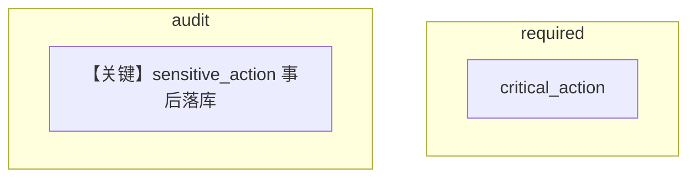

# audit_approval_overview.py — 实现原理分析

> 源文件：`cookbook/02_agents/11_approvals/audit_approval_overview.py`

## 概述

本示例对比 **默认 `@approval`（预批）** 与 **`@approval(type="audit")`（事后审计记录）**：两工具均 `requires_confirmation=True`，但 **pending 行出现时机/语义** 不同（脚本中断言与打印展示差异）。

**核心配置一览：**

| 工具 | 装饰器 |
|------|--------|
| `critical_action` | `@approval` |
| `sensitive_action` | `@approval(type="audit")` |

## 运行机制与因果链

审计型在 **resolve 前** 可能无记录（见 `audit_approval_async` 中「0 approvals before resolution」语义），用于 **事后追责** 而非阻塞队列。

## Mermaid 流程图

```mermaid
flowchart TD
    subgraph Pre["required"]
        C["critical_action"]
    end
    subgraph Audit["audit"]
        S["【关键】sensitive_action 事后落库"]
    end
```

## 关键源码文件索引

| 文件 | 作用 |
|------|------|
| `agno/approval` | `type="audit"` 语义 |
