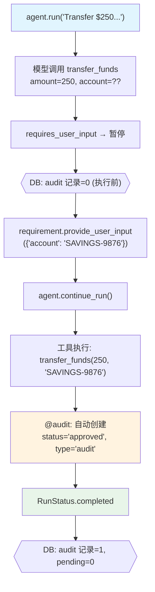

# audit_approval_user_input.py — 实现原理分析

> 源文件：`cookbook/02_agents/11_approvals/audit_approval_user_input.py`

## 概述

本示例展示 **`@approval(type="audit")` + `requires_user_input`** 的组合：用户输入提供敏感字段，工具执行后自动创建审计记录（无需手动 `update_approval`），兼顾了用户输入安全性和操作后审计追踪。

**核心配置一览：**

| 配置项 | 值 | 说明 |
|--------|------|------|
| `model` | `OpenAIResponses(id="gpt-5-mini")` | Responses API |
| `tools` | `[transfer_funds]` | @approval(type="audit") + requires_user_input |
| `markdown` | `True` | Markdown 格式 |
| `db` | `SqliteDb(approvals_table="approvals")` | 审计记录持久化 |

## 核心组件解析

### 三层组合机制

```python
@approval(type="audit")                           # 事后审计记录
@tool(requires_user_input=True,
      user_input_fields=["account"])              # 用户提供敏感账户
def transfer_funds(amount: float, account: str) -> str:
    return f"Transferred ${amount} to {account}"
```

执行流程：
1. 模型调用工具（不传 `account`）→ 暂停
2. 用户通过 `provide_user_input({"account": "SAVINGS-9876"})` 注入账户
3. 工具执行 → `@audit` 自动创建 `approved` 记录
4. **无**需手动调用 `db.update_approval()`

### 执行时序验证

```python
# 执行前：audit 无记录
run_response = agent.run("Transfer $250 to my savings account.")
approvals_list, total = db.get_approvals(approval_type="audit")
assert total == 0  # audit 模式，执行前无记录

# 提供用户输入并继续
for requirement in run_response.active_requirements:
    if requirement.needs_user_input:
        requirement.provide_user_input({"account": "SAVINGS-9876"})

run_response = agent.continue_run(
    run_id=run_response.run_id,
    requirements=run_response.requirements,
)

# 执行后：自动创建 audit 记录
approvals_list, total = db.get_approvals(approval_type="audit")
assert total >= 1
assert approvals_list[0]["status"] == "approved"
assert approvals_list[0]["approval_type"] == "audit"

# 无 pending 记录
pending_count = db.get_pending_approval_count()
assert pending_count == 0
```

## System Prompt 组装

```text
Respond using markdown.
```

## Mermaid 流程图



## 关键源码文件索引

| 文件 | 关键函数/类 | 作用 |
|------|------------|------|
| `agno/approval/__init__.py` | `approval(type="audit")` | 审计装饰器 |
| `agno/tools/__init__.py` | `tool(requires_user_input, user_input_fields)` | 用户输入字段声明 |
| `agno/agent/agent.py` | `continue_run()` | 恢复并触发审计 |
