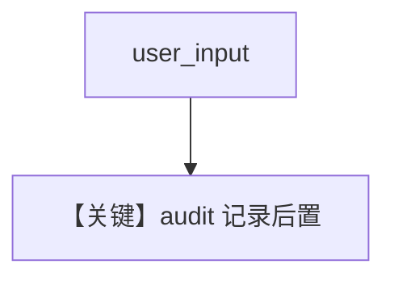

# audit_approval_user_input.py — 实现原理分析

> 源文件：`cookbook/02_agents/11_approvals/audit_approval_user_input.py`

## 概述

本示例展示 **`@approval(type="audit")` + `requires_user_input`**：`transfer_funds` 的 `account` 由用户输入；**resolve 前** `get_approvals(approval_type="audit")` 计数为 0（脚本断言）。

**核心配置：** `@tool(requires_user_input=True, user_input_fields=["account"])`。

## 运行机制与因果链

审计 + 敏感字段人工录入，适合转账类 **强合规** 流程。

## Mermaid 流程图

```mermaid
flowchart TD
    U["user_input"] --> T["【关键】audit 记录后置"]
```

## 关键源码文件索引

| 文件 | 作用 |
|------|------|
| `agno/approval` | audit 与用户输入组合 |
