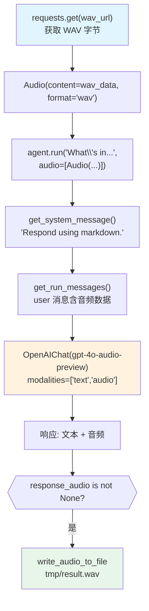

# audio_input_output.py — 实现原理分析

> 源文件：`cookbook/02_agents/12_multimodal/audio_input_output.py`

## 概述

本示例展示 Agno 的 **音频输入输出（Audio Input/Output）** 机制：使用 `gpt-4o-audio-preview` 模型的 `modalities=["text", "audio"]` 配置，接收 WAV 格式音频输入，同时生成文本和音频响应，并将音频写入本地文件。

**核心配置一览：**

| 配置项 | 值 | 说明 |
|--------|------|------|
| `model` | `OpenAIChat(id="gpt-4o-audio-preview")` | Chat Completions API，支持音频 |
| `model.modalities` | `["text", "audio"]` | 同时输出文字和音频 |
| `model.audio` | `{"voice": "sage", "format": "wav"}` | 音频输出配置 |
| `markdown` | `True` | Markdown 格式 |
| `instructions` | `None` | 未设置 |
| `tools` | `None` | 未设置 |

## 架构分层

```
用户代码层                    agno.agent 层
┌──────────────────────┐    ┌──────────────────────────────────────┐
│ audio_input_output.py│    │ Agent._run()                          │
│                      │    │  ├─ get_system_message()              │
│ agent.run(           │    │  │   → "Respond using markdown."      │
│   "What's in...",    │───>│  │                                    │
│   audio=[Audio(      │    │  └─ get_run_messages()                │
│     content=wav_data,│    │      ├─ system message                │
│     format="wav"     │    │      └─ user message (含音频数据)     │
│   )]                 │    └──────────────────────────────────────┘
│ )                    │                   │
│                      │                   ▼
│ run_response.        │    ┌──────────────────────────────────────┐
│   response_audio     │    │ OpenAIChat                            │
│                      │    │ gpt-4o-audio-preview                  │
│ write_audio_to_file  │    │ modalities=["text","audio"]           │
│   (response_audio.   │    │ audio={"voice":"sage","format":"wav"} │
│    content)          │    └──────────────────────────────────────┘
└──────────────────────┘
```

## 核心组件解析

### Audio 媒体类

```python
from agno.media import Audio

# 将 WAV 字节数据包装为 Audio 对象
audio = Audio(content=wav_data, format="wav")

# 传入 agent.run() 的 audio 参数
run_response = agent.run(
    "What's in these recording?",
    audio=[Audio(content=wav_data, format="wav")],
)
```

### modalities 与 audio 配置

```python
agent = Agent(
    model=OpenAIChat(
        id="gpt-4o-audio-preview",
        modalities=["text", "audio"],       # 同时生成文本和音频
        audio={"voice": "sage", "format": "wav"},  # 音频输出参数
    ),
    markdown=True,
)
```

### 音频响应处理

```python
if run_response.response_audio is not None:
    pprint(run_response.content)  # 文本内容
    write_audio_to_file(
        audio=run_response.response_audio.content,  # base64 音频数据
        filename="tmp/result.wav"
    )
```

| 字段 | 说明 |
|------|------|
| `run_response.content` | 文本转录内容 |
| `run_response.response_audio` | 音频响应对象 |
| `run_response.response_audio.content` | base64 编码的 WAV 数据 |

## System Prompt 组装

| 序号 | 组成部分 | 值 | 是否生效 |
|------|---------|-----|---------|
| 3.2.1 | `markdown` | `True` | 是 |
| 其他 | 均未设置 | - | 否 |

### 最终 System Prompt

```text
Respond using markdown.
```

## 完整 API 请求

```python
# Chat Completions API（OpenAIChat）
client.chat.completions.create(
    model="gpt-4o-audio-preview",
    modalities=["text", "audio"],
    audio={"voice": "sage", "format": "wav"},
    messages=[
        {"role": "system", "content": "Respond using markdown."},
        {
            "role": "user",
            "content": [
                {"type": "text", "text": "What's in these recording?"},
                {
                    "type": "input_audio",
                    "input_audio": {
                        "data": "<base64_wav_data>",
                        "format": "wav"
                    }
                }
            ]
        }
    ],
    stream=True,
    stream_options={"include_usage": True}
)
# 响应包含: choices[0].message.content (文本) + choices[0].message.audio (音频)
```

## Mermaid 流程图



## 关键源码文件索引

| 文件 | 关键函数/类 | 作用 |
|------|------------|------|
| `agno/media/__init__.py` | `Audio` | 音频媒体封装 |
| `agno/models/openai/chat.py` | `OpenAIChat` | Chat Completions API，支持 modalities |
| `agno/utils/audio.py` | `write_audio_to_file()` | 音频写入工具 |
| `agno/agent/_messages.py` | `get_run_messages()` L1146 | 消息组装（含音频） |
