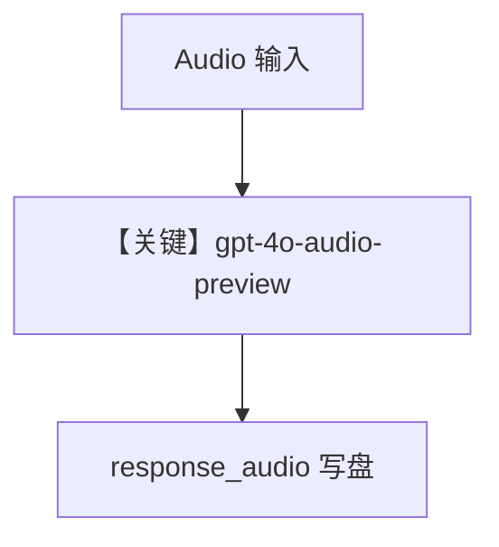

# audio_input_output.py — 实现原理分析

> 源文件：`cookbook/02_agents/12_multimodal/audio_input_output.py`

## 概述

本示例展示 **OpenAI 音频预览模型双向音频**：`OpenAIChat(id="gpt-4o-audio-preview", modalities=["text","audio"], audio={voice,format})`，输入 `Audio(content=wav_data)`，输出 `run_response.response_audio` 并写入 `tmp/result.wav`。

**核心配置一览：**

| 配置项 | 值 |
|--------|-----|
| `model` | `OpenAIChat` + `modalities`/`audio` 参数 |
| `markdown` | `True` |

## 运行机制与因果链

Chat Completions 多模态路径；`write_audio_to_file` 持久化模型生成的音频字节。

## System Prompt 组装

无显式 `instructions`。

## 完整 API 请求

`chat.completions` 带音频模态（以 OpenAI 当前预览 API 为准）。

## Mermaid 流程图

```mermaid
flowchart TD
    I["Audio 输入"] --> M["【关键】gpt-4o-audio-preview"]
    M --> O["response_audio 写盘"]
```

## 关键源码文件索引

| 文件 | 作用 |
|------|------|
| `agno/models/openai/chat.py` | 多模态消息格式化 |
| `agno/utils/audio` | `write_audio_to_file` |
