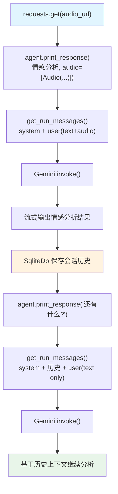

# audio_sentiment_analysis.py — 实现原理分析

> 源文件：`cookbook/02_agents/12_multimodal/audio_sentiment_analysis.py`

## 概述

本示例展示 Agno 的 **音频情感分析 + 多轮对话**机制：使用 Gemini 模型处理音频输入进行情感分析，并利用 `add_history_to_context=True` 实现跨轮对话记忆，在后续轮次中无需重新传入音频。

**核心配置一览：**

| 配置项 | 值 | 说明 |
|--------|------|------|
| `model` | `Gemini(id="gemini-3-flash-preview")` | Google Gemini，原生支持音频 |
| `add_history_to_context` | `True` | 保留历史消息，支持多轮对话 |
| `markdown` | `True` | Markdown 格式 |
| `db` | `SqliteDb(session_table=..., db_file=...)` | 会话持久化 |
| `instructions` | `None` | 未设置 |
| `tools` | `None` | 未设置 |

## 架构分层

```
用户代码层                    agno.agent 层
┌──────────────────────┐    ┌──────────────────────────────────────┐
│ audio_sentiment_     │    │ 第一轮: Agent._run()                  │
│ analysis.py          │    │  ├─ get_system_message()              │
│                      │    │  └─ get_run_messages()                │
│ agent.print_response │    │      ├─ system message                │
│   (分析情感...,      │───>│      └─ user(text + audio_data)      │
│    audio=[Audio(     │    │                                       │
│     audio_content)]) │    │ 第二轮: Agent._run()                  │
│                      │    │  ├─ get_system_message()              │
│ agent.print_response │    │  └─ get_run_messages()                │
│   ("还有什么...")    │───>│      ├─ system message                │
│                      │    │      ├─ 历史消息（第一轮Q+A）          │
│                      │    │      └─ user(text only，无音频)       │
└──────────────────────┘    └──────────────────────────────────────┘
                                          │
                                          ▼
                              ┌──────────────────────┐
                              │ Gemini               │
                              │ gemini-3-flash-preview│
                              └──────────────────────┘
```

## 核心组件解析

### Audio 媒体类（无 format 参数）

```python
from agno.media import Audio

# Gemini 支持直接传入音频字节，无需指定 format
audio = Audio(content=audio_content)

agent.print_response(
    "Give a sentiment analysis...",
    audio=[Audio(content=audio_content)],
    stream=True,
)
```

### 多轮对话：历史记忆

```python
agent = Agent(
    model=Gemini(id="gemini-3-flash-preview"),
    add_history_to_context=True,  # 关键：保留历史消息
    db=SqliteDb(...),              # 持久化（可选，支持跨进程记忆）
)

# 第一轮：传入音频
agent.print_response(
    "Give a sentiment analysis...",
    audio=[Audio(content=audio_content)],
    stream=True,
)

# 第二轮：无需重传音频，历史消息中已有上下文
agent.print_response(
    "What else can you tell me about this audio conversation?",
    stream=True,
)
```

### Gemini vs OpenAI 音频处理差异

| 特性 | OpenAI (`gpt-4o-audio-preview`) | Gemini (`gemini-3-flash-preview`) |
|------|----------------------------------|-----------------------------------|
| 输出模态 | text + audio（需 `modalities`） | 仅 text |
| 音频输入格式 | 需指定 `format="wav/mp3"` | 自动识别 |
| 音频输出 | 支持（`response_audio`） | 不支持 |

## System Prompt 组装

| 序号 | 组成部分 | 值 | 是否生效 |
|------|---------|-----|---------|
| 3.2.1 | `markdown` | `True` | 是 |
| 其他 | 均未设置 | - | 否 |

### 最终 System Prompt

```text
Respond using markdown.
```

## 完整 API 请求

```python
# Gemini 使用 generate_content API（通过 agno 适配层）
# 第一轮（含音频）
client.generate_content(
    model="gemini-3-flash-preview",
    contents=[
        {"role": "user", "parts": [
            {"text": "Give a sentiment analysis of this audio conversation..."},
            {"inline_data": {"mime_type": "audio/wav", "data": "<base64_audio>"}}
        ]}
    ],
    system_instruction="Respond using markdown.",
    stream=True
)

# 第二轮（仅文本，历史已包含上一轮对话）
client.generate_content(
    model="gemini-3-flash-preview",
    contents=[
        {"role": "user", "parts": [{"text": "Give a sentiment analysis..."}, {"inline_data": ...}]},
        {"role": "model", "parts": [{"text": "...分析结果..."}]},
        {"role": "user", "parts": [{"text": "What else can you tell me..."}]}
    ],
    system_instruction="Respond using markdown.",
    stream=True
)
```

## Mermaid 流程图



## 关键源码文件索引

| 文件 | 关键函数/类 | 作用 |
|------|------------|------|
| `agno/media/__init__.py` | `Audio` | 音频媒体封装 |
| `agno/models/google/` | `Gemini` | Gemini 模型适配层 |
| `agno/agent/_messages.py` | `get_run_messages()` L1231-1262 | 历史消息注入 |
