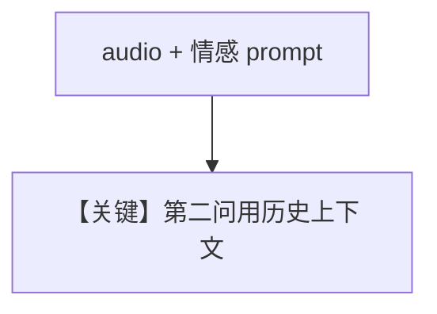

# audio_sentiment_analysis.py — 实现原理分析

> 源文件：`cookbook/02_agents/12_multimodal/audio_sentiment_analysis.py`

## 概述

本示例展示 **Gemini + 音频输入 + 会话历史**：`Gemini(id="gemini-3-flash-preview")`，`add_history_to_context=True`，`db` 持久会话；两轮 `print_response` 分析同一段对话音频的情感与后续追问。

**核心配置一览：**

| 配置项 | 值 |
|--------|-----|
| `model` | `Gemini(...)` |
| `add_history_to_context` | `True` |
| `db` | `SqliteDb(...)` |
| `markdown` | `True` |

## 运行机制与因果链

首轮带 `audio=[Audio(content=...)]`；次轮依赖 **历史** 延续分析。

参照用户句：首轮情感分析指令为 `.py` 中字面量。

## 完整 API 请求

Google Gemini API（`agno/models/google` 适配器）。

## Mermaid 流程图

```mermaid
flowchart TD
    A1["audio + 情感 prompt"] --> A2["【关键】第二问用历史上下文"]
```

## 关键源码文件索引

| 文件 | 作用 |
|------|------|
| `agno/models/google` | Gemini `invoke` |
