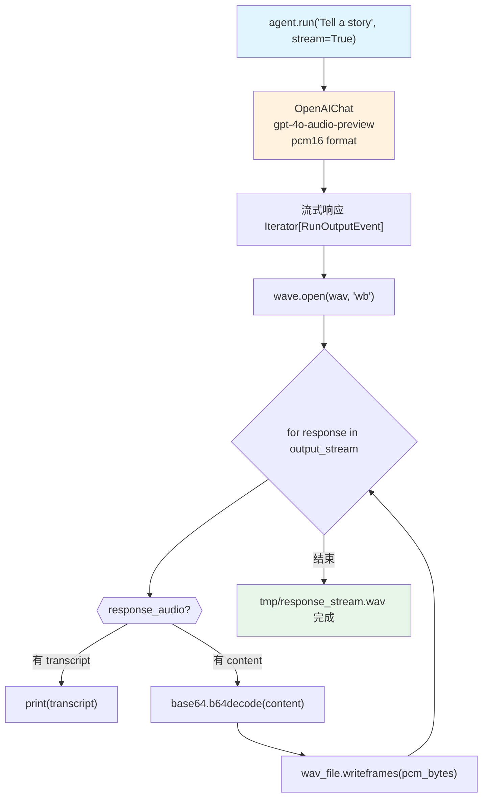

# audio_streaming.py — 实现原理分析

> 源文件：`cookbook/02_agents/12_multimodal/audio_streaming.py`

## 概述

本示例展示 Agno 的 **音频流式输出**机制：使用 `gpt-4o-audio-preview` 的 `pcm16` 格式（唯一支持流式的格式），实时解码 base64 PCM 数据并写入 WAV 文件，通过 `RunOutputEvent` 流逐块获取音频内容。

**核心配置一览：**

| 配置项 | 值 | 说明 |
|--------|------|------|
| `model` | `OpenAIChat(id="gpt-4o-audio-preview")` | Chat Completions API |
| `model.modalities` | `["text", "audio"]` | 同时输出文本和音频 |
| `model.audio` | `{"voice": "alloy", "format": "pcm16"}` | 流式必须用 pcm16 |
| `instructions` | `None` | 未设置 |
| `tools` | `None` | 未设置 |

## 架构分层

```
用户代码层                    agno.agent 层
┌──────────────────────┐    ┌──────────────────────────────────────┐
│ audio_streaming.py   │    │ agent.run(stream=True)                │
│                      │    │  └─ 流式返回 Iterator[RunOutputEvent] │
│ output_stream =      │───>│                                       │
│   agent.run(         │    │ 每个 RunOutputEvent 包含:             │
│     "Tell a story",  │    │  ├─ response_audio.transcript (文本) │
│     stream=True      │    │  └─ response_audio.content (base64)  │
│   )                  │    └──────────────────────────────────────┘
│                      │                   │
│ for response in      │                   ▼
│   output_stream:     │    ┌──────────────────────────────────────┐
│   decode(pcm_bytes)  │    │ OpenAIChat                            │
│   wav_file.          │    │ gpt-4o-audio-preview                  │
│     writeframes()    │    │ modalities=["text","audio"]           │
└──────────────────────┘    │ audio={"voice":"alloy","format":"pcm16"}│
                            └──────────────────────────────────────┘
```

## 核心组件解析

### pcm16 格式与流式音频

```python
# 音频配置
SAMPLE_RATE = 24000   # Hz（24kHz）
CHANNELS = 1          # Mono
SAMPLE_WIDTH = 2      # Bytes（16 bits，对应 pcm16）

agent = Agent(
    model=OpenAIChat(
        id="gpt-4o-audio-preview",
        modalities=["text", "audio"],
        audio={
            "voice": "alloy",
            "format": "pcm16",  # 仅 pcm16 支持流式传输
        },
    ),
)
```

### 流式音频写入

```python
output_stream: Iterator[RunOutputEvent] = agent.run("Tell me a 10 second story", stream=True)

with wave.open("tmp/response_stream.wav", "wb") as wav_file:
    wav_file.setnchannels(CHANNELS)
    wav_file.setsampwidth(SAMPLE_WIDTH)
    wav_file.setframerate(SAMPLE_RATE)

    for response in output_stream:
        response_audio = response.response_audio
        if response_audio:
            # 文本转写（打印）
            if response_audio.transcript:
                print(response_audio.transcript, end="", flush=True)
            # 音频块（解码并写入）
            if response_audio.content:
                pcm_bytes = base64.b64decode(response_audio.content)
                wav_file.writeframes(pcm_bytes)
```

### RunOutputEvent 字段

| 字段 | 类型 | 说明 |
|------|------|------|
| `response_audio.transcript` | `str` | 本块的文本转写 |
| `response_audio.content` | `str` | base64 编码的 pcm16 音频块 |

## System Prompt 组装

无显式 system prompt（未设置 markdown/instructions/description）：

```text
（空）
```

## 完整 API 请求

```python
client.chat.completions.create(
    model="gpt-4o-audio-preview",
    modalities=["text", "audio"],
    audio={"voice": "alloy", "format": "pcm16"},
    messages=[
        {"role": "user", "content": "Tell me a 10 second story"}
    ],
    stream=True,
    stream_options={"include_usage": True}
)
# 流式响应: 每个 chunk 包含 delta.audio.data (base64 pcm16) + delta.audio.transcript
```

## Mermaid 流程图



## 关键源码文件索引

| 文件 | 关键函数/类 | 作用 |
|------|------------|------|
| `agno/models/openai/chat.py` | `OpenAIChat` | 音频流式支持 |
| `agno/run/agent.py` | `RunOutputEvent` | 流式事件，含 response_audio |
| `agno/agent/_run.py` | `_run()` | stream=True 流式处理 |
