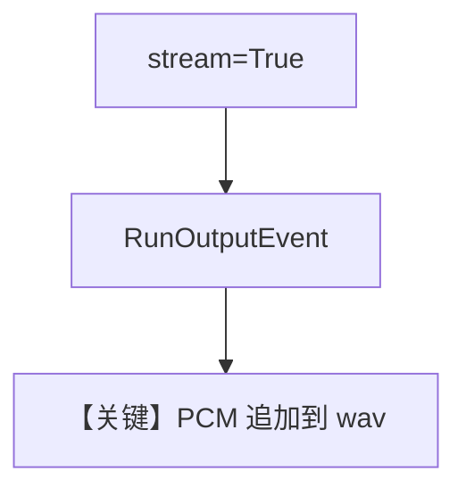

# audio_streaming.py — 实现原理分析

> 源文件：`cookbook/02_agents/12_multimodal/audio_streaming.py`

## 概述

本示例展示 **流式音频输出为 PCM 并写 WAV**：`OpenAIChat` 音频预览，`format="pcm16"`；迭代 `RunOutputEvent`，拼 `response_audio.transcript` 与解码 `response_audio.content` 为 PCM 帧写入 `tmp/response_stream.wav`。

**核心配置：** `modalities=["text","audio"]`，`audio.voice/format`。

## 运行机制与因果链

流式场景仅 **pcm16**（注释）；边收边写 wave 文件。

## Mermaid 流程图

```mermaid
flowchart TD
    S["stream=True"] --> E["RunOutputEvent"]
    E --> P["【关键】PCM 追加到 wav"]
```

## 关键源码文件索引

| 文件 | 作用 |
|------|------|
| `agno/agent` | `RunOutputEvent`；`response_audio` |
