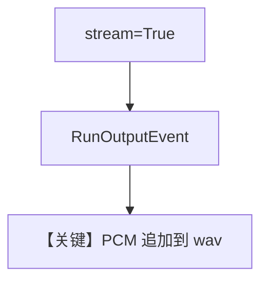

# audio_streaming.py — 实现原理分析

<!-- cookbook-py-source:start -->
## 完整源码

```python
"""
Audio Streaming
=============================

Audio Streaming.
"""

import base64
import wave
from typing import Iterator

from agno.agent import Agent, RunOutputEvent
from agno.models.openai import OpenAIChat

# Audio Configuration
SAMPLE_RATE = 24000  # Hz (24kHz)
CHANNELS = 1  # Mono (Change to 2 if Stereo)
SAMPLE_WIDTH = 2  # Bytes (16 bits)

# Provide the agent with the audio file and audio configuration and get result as text + audio
# ---------------------------------------------------------------------------
# Create Agent
# ---------------------------------------------------------------------------
agent = Agent(
    model=OpenAIChat(
        id="gpt-4o-audio-preview",
        modalities=["text", "audio"],
        audio={
            "voice": "alloy",
            "format": "pcm16",
        },  # Only pcm16 is supported with streaming
    ),
)

# ---------------------------------------------------------------------------
# Run Agent
# ---------------------------------------------------------------------------
if __name__ == "__main__":
    output_stream: Iterator[RunOutputEvent] = agent.run(
        "Tell me a 10 second story", stream=True
    )

    filename = "tmp/response_stream.wav"

    # Open the file once in append-binary mode
    with wave.open(str(filename), "wb") as wav_file:
        wav_file.setnchannels(CHANNELS)
        wav_file.setsampwidth(SAMPLE_WIDTH)
        wav_file.setframerate(SAMPLE_RATE)

        # Iterate over generated audio
        for response in output_stream:
            response_audio = response.response_audio  # type: ignore
            if response_audio:
                if response_audio.transcript:
                    print(response_audio.transcript, end="", flush=True)
                if response_audio.content:
                    try:
                        pcm_bytes = base64.b64decode(response_audio.content)
                        wav_file.writeframes(pcm_bytes)
                    except Exception as e:
                        print(f"Error decoding audio: {e}")
    print()
```

<!-- cookbook-py-source:end -->

> 源文件：`cookbook/02_agents/12_multimodal/audio_streaming.py`

## 概述

本示例展示 **流式音频输出为 PCM 并写 WAV**：`OpenAIChat` 音频预览，`format="pcm16"`；迭代 `RunOutputEvent`，拼 `response_audio.transcript` 与解码 `response_audio.content` 为 PCM 帧写入 `tmp/response_stream.wav`。

**核心配置：** `modalities=["text","audio"]`，`audio.voice/format`。

## 运行机制与因果链

流式场景仅 **pcm16**（注释）；边收边写 wave 文件。

## Mermaid 流程图


```mermaid
flowchart TD
    S["stream=True"] --> E["RunOutputEvent"]
    E --> P["【关键】PCM 追加到 wav"]
```

## 关键源码文件索引

| 文件 | 作用 |
|------|------|
| `agno/agent` | `RunOutputEvent`；`response_audio` |
