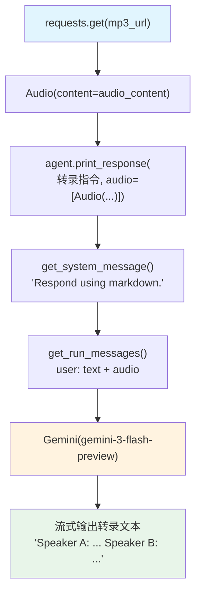

# audio_to_text.py — 实现原理分析

> 源文件：`cookbook/02_agents/12_multimodal/audio_to_text.py`

## 概述

本示例展示 Agno 最简单的 **音频转文字（音频转录）** 用法：使用 Gemini 模型将 MP3 格式音频转为文字转录，以说话人标注（speaker A/B）的方式输出。

**核心配置一览：**

| 配置项 | 值 | 说明 |
|--------|------|------|
| `model` | `Gemini(id="gemini-3-flash-preview")` | Gemini，原生多模态 |
| `markdown` | `True` | Markdown 格式 |
| `instructions` | `None` | 未设置 |
| `tools` | `None` | 未设置 |
| `db` | `None` | 未设置（无持久化） |

## 架构分层

```
用户代码层                    agno.agent 层
┌──────────────────────┐    ┌──────────────────────────────────────┐
│ audio_to_text.py     │    │ Agent._run()                          │
│                      │    │  ├─ get_system_message()              │
│ agent.print_response │    │  │   → "Respond using markdown."      │
│   (转录指令,         │───>│  └─ get_run_messages()                │
│    audio=[Audio(     │    │      ├─ system message                │
│     audio_content)]) │    │      └─ user message (text + audio)  │
│                      │    └──────────────────────────────────────┘
└──────────────────────┘                   │
                                           ▼
                              ┌──────────────────────┐
                              │ Gemini               │
                              │ gemini-3-flash-preview│
                              └──────────────────────┘
```

## 核心组件解析

### 音频下载与传入

```python
url = "https://agno-public.s3.us-east-1.amazonaws.com/demo_data/QA-01.mp3"
response = requests.get(url)
audio_content = response.content  # MP3 字节数据

agent.print_response(
    "Give a transcript of this audio conversation. "
    "Use speaker A, speaker B to identify speakers.",
    audio=[Audio(content=audio_content)],  # 无需指定 format（Gemini 自动识别）
    stream=True,
)
```

### 与 audio_sentiment_analysis.py 的差异

| 特性 | audio_to_text.py | audio_sentiment_analysis.py |
|------|-----------------|------------------------------|
| 任务 | 转录 | 情感分析 + 多轮 |
| 历史 | `add_history_to_context=False` | `True` |
| 持久化 | 无 DB | SqliteDb |
| 轮次 | 单轮 | 多轮 |
| 音频格式 | MP3 | WAV |

## System Prompt 组装

```text
Respond using markdown.
```

## 完整 API 请求

```python
client.generate_content(
    model="gemini-3-flash-preview",
    contents=[
        {"role": "user", "parts": [
            {"text": "Give a transcript of this audio conversation. Use speaker A, speaker B to identify speakers."},
            {"inline_data": {"mime_type": "audio/mp3", "data": "<base64_mp3_data>"}}
        ]}
    ],
    system_instruction="Respond using markdown.",
    stream=True
)
```

## Mermaid 流程图



## 关键源码文件索引

| 文件 | 关键函数/类 | 作用 |
|------|------------|------|
| `agno/media/__init__.py` | `Audio` | 音频媒体封装 |
| `agno/models/google/` | `Gemini` | Google Gemini 适配层 |
| `agno/agent/_messages.py` | `get_run_messages()` L1265 | 用户消息含音频数据 |
