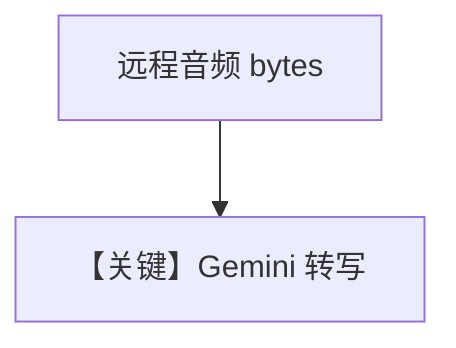

# audio_to_text.py — 实现原理分析

<!-- cookbook-py-source:start -->
## 完整源码

```python
"""
Audio To Text
=============================

Audio To Text.
"""

import requests
from agno.agent import Agent
from agno.media import Audio
from agno.models.google import Gemini

# ---------------------------------------------------------------------------
# Create Agent
# ---------------------------------------------------------------------------
agent = Agent(
    model=Gemini(id="gemini-3-flash-preview"),
    markdown=True,
)

url = "https://agno-public.s3.us-east-1.amazonaws.com/demo_data/QA-01.mp3"

response = requests.get(url)
audio_content = response.content

# ---------------------------------------------------------------------------
# Run Agent
# ---------------------------------------------------------------------------
if __name__ == "__main__":
    # Give a transcript of this audio conversation. Use speaker A, speaker B to identify speakers.

    agent.print_response(
        "Give a transcript of this audio conversation. Use speaker A, speaker B to identify speakers.",
        audio=[Audio(content=audio_content)],
        stream=True,
    )
```

<!-- cookbook-py-source:end -->

> 源文件：`cookbook/02_agents/12_multimodal/audio_to_text.py`

## 概述

本示例展示 **Gemini 音频转写**：远程下载 mp3，`Audio(content=...)` 传入，`print_response` 要求说话人 A/B 分段转录。

**核心配置：** `Gemini`；`markdown=True`。

## System Prompt 组装

无自定义 `instructions`；用户消息为转录指令字面量（见 `.py`）。

## 完整 API 请求

Gemini 多模态 `generate_content` 类请求（以适配器为准）。

## Mermaid 流程图


```mermaid
flowchart TD
    MP3["远程音频 bytes"] --> G["【关键】Gemini 转写"]
```

## 关键源码文件索引

| 文件 | 作用 |
|------|------|
| `agno/media` | `Audio` |
