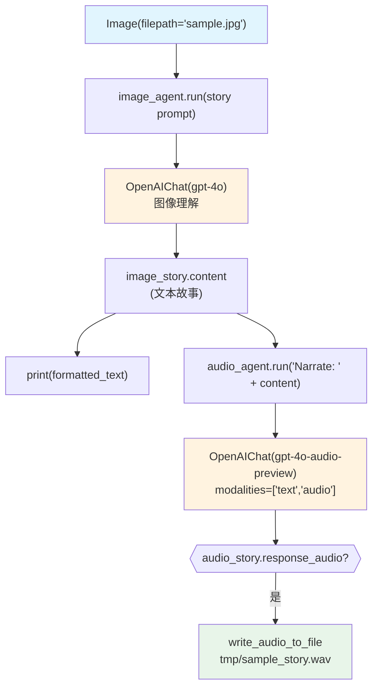

# image_to_audio.py — 实现原理分析

> 源文件：`cookbook/02_agents/12_multimodal/image_to_audio.py`

## 概述

本示例展示 **双 Agent 串联多模态管道**：`image_agent`（gpt-4o）分析图像生成故事文本，`audio_agent`（gpt-4o-audio-preview）将文本转为语音输出，体现 Agno 单 Agent 复用和多模态链式处理模式。

**核心配置一览：**

| Agent | 模型 | 输入 | 输出 |
|-------|------|------|------|
| `image_agent` | `OpenAIChat(id="gpt-4o")` | Image (filepath) | 文本故事 |
| `audio_agent` | `OpenAIChat(id="gpt-4o-audio-preview")` | 文本（故事内容） | WAV 音频 |

| 配置项 | image_agent | audio_agent |
|--------|------------|------------|
| `modalities` | 未设置（仅文本） | `["text", "audio"]` |
| `audio` | 未设置 | `{"voice": "sage", "format": "wav"}` |
| `tools` | 未设置 | 未设置 |
| `instructions` | 未设置 | 未设置 |

## 架构分层

```
用户代码层                    agno.agent 层
┌──────────────────────┐    ┌─────────────────────────────────────────┐
│ image_to_audio.py    │    │ Step 1: image_agent._run()              │
│                      │    │  └─ user 消息含 Image(filepath)         │
│ image_story =        │    │     → OpenAIChat(gpt-4o) 分析图像       │
│   image_agent.run(   │───>│     → 返回文本故事                      │
│     images=[Image(   │    │                                         │
│       filepath)]     │    │ Step 2: audio_agent._run()              │
│   )                  │    │  └─ user 消息含文本（story.content）    │
│                      │    │     → OpenAIChat(gpt-4o-audio-preview)  │
│ audio_story =        │    │     → 返回文本 + 音频                   │
│   audio_agent.run(   │───>│                                         │
│     story.content    │    └─────────────────────────────────────────┘
│   )                  │                │
│                      │                ▼
│ write_audio_to_file  │    ┌─────────────────────────────────────────┐
│   (audio_story.      │    │ OpenAIChat gpt-4o          (图像分析)  │
│    response_audio.   │    │ OpenAIChat gpt-4o-audio-preview (TTS)  │
│    content)          │    └─────────────────────────────────────────┘
└──────────────────────┘
```

## 核心组件解析

### Image 媒体类

```python
from agno.media import Image

image_path = Path(__file__).parent.joinpath("sample.jpg")
image = Image(filepath=image_path)  # 本地文件路径

image_story = image_agent.run(
    "Write a 3 sentence fiction story about the image",
    images=[Image(filepath=image_path)],
)
```

### 串联模式（非 Team）

```python
# Agent 1：图像 → 文本
image_agent = Agent(model=OpenAIChat(id="gpt-4o"))
image_story: RunOutput = image_agent.run(
    "Write a 3 sentence fiction story about the image",
    images=[Image(filepath=image_path)],
)

# Agent 2：文本 → 音频（注意：audio_agent 在 if __name__ == "__main__" 内创建）
audio_agent = Agent(
    model=OpenAIChat(
        id="gpt-4o-audio-preview",
        modalities=["text", "audio"],
        audio={"voice": "sage", "format": "wav"},
    ),
)
audio_story: RunOutput = audio_agent.run(
    f"Narrate the story with flair: {image_story.content}"
)

# 写入音频文件
if audio_story.response_audio is not None:
    write_audio_to_file(
        audio=audio_story.response_audio.content,
        filename="tmp/sample_story.wav"
    )
```

## System Prompt 组装

两个 Agent 均未设置任何 system prompt 参数：

```text
（空）
```

## 完整 API 请求

```python
# Agent 1: 图像分析
client.chat.completions.create(
    model="gpt-4o",
    messages=[
        {"role": "user", "content": [
            {"type": "text", "text": "Write a 3 sentence fiction story about the image"},
            {"type": "image_url", "image_url": {"url": "data:image/jpeg;base64,<...>"}}
        ]}
    ],
    stream=False
)

# Agent 2: 文字转语音
client.chat.completions.create(
    model="gpt-4o-audio-preview",
    modalities=["text", "audio"],
    audio={"voice": "sage", "format": "wav"},
    messages=[
        {"role": "user", "content": "Narrate the story with flair: <story_content>"}
    ],
    stream=False
)
```

## Mermaid 流程图



## 关键源码文件索引

| 文件 | 关键函数/类 | 作用 |
|------|------------|------|
| `agno/media/__init__.py` | `Image`, `Audio` | 媒体封装类 |
| `agno/models/openai/chat.py` | `OpenAIChat` | gpt-4o 和 gpt-4o-audio-preview |
| `agno/run/agent.py` | `RunOutput` | 包含 content 和 response_audio |
| `agno/utils/audio.py` | `write_audio_to_file()` | 音频写入 |
