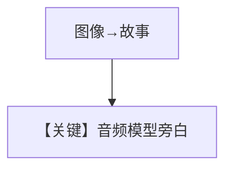

# image_to_audio.py — 实现原理分析

> 源文件：`cookbook/02_agents/12_multimodal/image_to_audio.py`

## 概述

本示例展示 **两阶段管线**：先用 **`gpt-4o`** 对 `sample.jpg` 写故事，再用 **`gpt-4o-audio-preview`** 将故事 **朗读为 wav**（`write_audio_to_file`）。两个 Agent 分工明确。

**核心配置：** `image_agent` + `audio_agent` 各独立构造。

## 运行机制与因果链

文本故事不依赖音频模型；TTS 阶段仅消费上一步字符串。

## Mermaid 流程图

```mermaid
flowchart TD
    I["图像→故事"] --> T["【关键】音频模型旁白"]
```

## 关键源码文件索引

| 文件 | 作用 |
|------|------|
| `agno/media` | `Image` |
