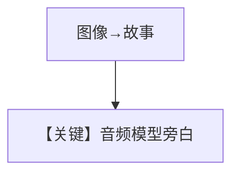

# image_to_audio.py — 实现原理分析

<!-- cookbook-py-source:start -->
## 完整源码

```python
"""
Image To Audio
=============================

Image To Audio.
"""

from pathlib import Path

from agno.agent import Agent, RunOutput
from agno.media import Image
from agno.models.openai import OpenAIChat
from agno.utils.audio import write_audio_to_file
from rich import print
from rich.text import Text

cwd = Path(__file__).parent.resolve()

# ---------------------------------------------------------------------------
# Create Agent
# ---------------------------------------------------------------------------
image_agent = Agent(model=OpenAIChat(id="gpt-4o"))

image_path = Path(__file__).parent.joinpath("sample.jpg")

# ---------------------------------------------------------------------------
# Run Agent
# ---------------------------------------------------------------------------
if __name__ == "__main__":
    image_story: RunOutput = image_agent.run(
        "Write a 3 sentence fiction story about the image",
        images=[Image(filepath=image_path)],
    )
    formatted_text = Text.from_markup(
        f":sparkles: [bold magenta]Story:[/bold magenta] {image_story.content} :sparkles:"
    )
    print(formatted_text)

    audio_agent = Agent(
        model=OpenAIChat(
            id="gpt-4o-audio-preview",
            modalities=["text", "audio"],
            audio={"voice": "sage", "format": "wav"},
        ),
    )

    audio_story: RunOutput = audio_agent.run(
        f"Narrate the story with flair: {image_story.content}"
    )
    if audio_story.response_audio is not None:
        write_audio_to_file(
            audio=audio_story.response_audio.content, filename="tmp/sample_story.wav"
        )
```

<!-- cookbook-py-source:end -->

> 源文件：`cookbook/02_agents/12_multimodal/image_to_audio.py`

## 概述

本示例展示 **两阶段管线**：先用 **`gpt-4o`** 对 `sample.jpg` 写故事，再用 **`gpt-4o-audio-preview`** 将故事 **朗读为 wav**（`write_audio_to_file`）。两个 Agent 分工明确。

**核心配置：** `image_agent` + `audio_agent` 各独立构造。

## 运行机制与因果链

文本故事不依赖音频模型；TTS 阶段仅消费上一步字符串。

## Mermaid 流程图


```mermaid
flowchart TD
    I["图像→故事"] --> T["【关键】音频模型旁白"]
```

## 关键源码文件索引

| 文件 | 作用 |
|------|------|
| `agno/media` | `Image` |
