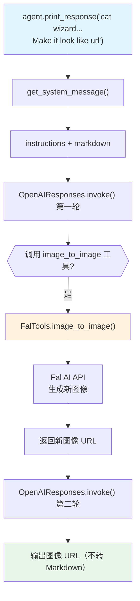

# image_to_image.py — 实现原理分析

> 源文件：`cookbook/02_agents/12_multimodal/image_to_image.py`

## 概述

本示例展示 Agno 的 **图像到图像生成**机制：使用 `FalTools` 工具，Agent 接收图像 URL + 风格描述，调用 Fal AI API 生成风格转换后的图像并返回 URL。

**核心配置一览：**

| 配置项 | 值 | 说明 |
|--------|------|------|
| `id` | `"image-to-image"` | Agent ID |
| `name` | `"Image to Image Agent"` | Agent 名称 |
| `model` | `OpenAIResponses(id="gpt-5.2")` | Responses API |
| `tools` | `[FalTools()]` | Fal AI 图像工具 |
| `markdown` | `True` | Markdown 格式 |
| `instructions` | `[...]` | 4条工具使用指令 |

## 架构分层

```
用户代码层                    agno.agent 层
┌──────────────────────┐    ┌──────────────────────────────────────┐
│ image_to_image.py    │    │ Agent._run()                          │
│                      │    │  ├─ get_system_message()              │
│ agent.print_response │    │  │   → instructions + markdown        │
│   ("a cat wizard..  │───>│  └─ get_run_messages()                │
│    Make it look      │    │      ├─ system message                │
│    like 'url'...")   │    │      └─ user message                 │
│                      │    │                                       │
│ → 返回生成图像 URL   │    │  Model 调用 FalTools.image_to_image  │
└──────────────────────┘    └──────────────────────────────────────┘
                                           │
                    ┌──────────────────────┼─────────────────────────┐
                    ▼                      ▼                         
        ┌──────────────────┐    ┌────────────────────────┐          
        │ OpenAIResponses  │    │ FalTools               │          
        │ gpt-5.2          │    │ image_to_image API     │          
        └──────────────────┘    └────────────────────────┘          
```

## 核心组件解析

### FalTools 图像工具

```python
from agno.tools.fal import FalTools

agent = Agent(
    model=OpenAIResponses(id="gpt-5.2"),
    tools=[FalTools()],  # 包含 image_to_image 等工具
    instructions=[
        "You have to use the `image_to_image` tool to generate the image.",
        "You are an AI agent that can generate images using the Fal AI API.",
        "You will be given a prompt and an image URL.",
        "You have to return the image URL as provided, don't convert it to markdown.",
    ],
)
```

### 工具调用流程

1. 用户提供：目标描述 + 参考图像 URL
2. 模型解析需求 → 调用 `image_to_image` 工具
3. FalTools 调用 Fal AI API → 生成图像 → 返回新图像 URL
4. 模型将 URL 原样输出（`instructions` 强制要求不转换为 Markdown）

## System Prompt 组装

| 序号 | 组成部分 | 值 | 是否生效 |
|------|---------|-----|---------|
| 3.3.3 | `instructions` 拼接 | 4条指令 | 是 |
| 3.2.1 | `markdown` | `True` | 是 |

### 最终 System Prompt

```text
You have to use the `image_to_image` tool to generate the image.
You are an AI agent that can generate images using the Fal AI API.
You will be given a prompt and an image URL.
You have to return the image URL as provided, don't convert it to markdown or anything else.

Respond using markdown.
```

## 完整 API 请求

```python
# 第一轮：模型决定调用工具
client.responses.create(
    model="gpt-5.2",
    input=[
        {"role": "developer", "content": "<system_prompt>"},
        {"role": "user", "content": "a cat dressed as a wizard with a background of a mystic forest. Make it look like 'https://fal.media/files/koala/...'"}
    ],
    tools=[{
        "type": "function",
        "name": "image_to_image",
        "description": "Generate image using Fal AI image-to-image API",
        "parameters": {
            "properties": {
                "prompt": {"type": "string"},
                "image_url": {"type": "string"}
            }
        }
    }],
    stream=True
)

# 第二轮：携带工具结果
client.responses.create(
    model="gpt-5.2",
    input=[
        ...,
        {"role": "assistant", "tool_calls": [{"name": "image_to_image", ...}]},
        {"role": "tool", "content": "https://fal.media/files/...new_image_url..."}
    ],
    stream=True
)
```

## Mermaid 流程图



## 关键源码文件索引

| 文件 | 关键函数/类 | 作用 |
|------|------------|------|
| `agno/tools/fal.py` | `FalTools` | Fal AI 图像生成工具集 |
| `agno/models/openai/responses.py` | `OpenAIResponses` | Responses API |
| `agno/agent/_messages.py` | `get_system_message()` L163-174 | instructions 解析 |
