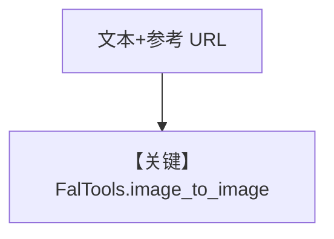

# image_to_image.py — 实现原理分析

<!-- cookbook-py-source:start -->
## 完整源码

```python
"""
Image To Image
=============================

Image To Image.
"""

from agno.agent import Agent
from agno.models.openai import OpenAIResponses
from agno.tools.fal import FalTools

# ---------------------------------------------------------------------------
# Create Agent
# ---------------------------------------------------------------------------
agent = Agent(
    model=OpenAIResponses(id="gpt-5.2"),
    id="image-to-image",
    name="Image to Image Agent",
    tools=[FalTools()],
    markdown=True,
    instructions=[
        "You have to use the `image_to_image` tool to generate the image.",
        "You are an AI agent that can generate images using the Fal AI API.",
        "You will be given a prompt and an image URL.",
        "You have to return the image URL as provided, don't convert it to markdown or anything else.",
    ],
)

# ---------------------------------------------------------------------------
# Run Agent
# ---------------------------------------------------------------------------
if __name__ == "__main__":
    agent.print_response(
        "a cat dressed as a wizard with a background of a mystic forest. Make it look like 'https://fal.media/files/koala/Chls9L2ZnvuipUTEwlnJC.png'",
        stream=True,
    )
```

<!-- cookbook-py-source:end -->

> 源文件：`cookbook/02_agents/12_multimodal/image_to_image.py`

## 概述

本示例展示 **`FalTools` 图生图**：`OpenAIResponses` + `tools=[FalTools()]`，`instructions` 强制调用 `image_to_image` 并原样返回 URL。

**核心配置一览：**

| 配置项 | 值 |
|--------|-----|
| `id` / `name` | `"image-to-image"` / `"Image to Image Agent"` |
| `model` | `OpenAIResponses(id="gpt-5.2")` |
| `tools` | `[FalTools()]` |
| `instructions` | 四条（见 `.py`） |

## 运行机制与因果链

模型根据用户 prompt + 参考图 URL 调 Fal API；**不**把结果误标为 markdown 图片链。

## Mermaid 流程图


```mermaid
flowchart TD
    U["文本+参考 URL"] --> F["【关键】FalTools.image_to_image"]
```

## 关键源码文件索引

| 文件 | 作用 |
|------|------|
| `agno/tools/fal` | `FalTools` |
