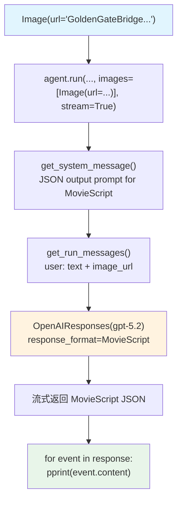

# image_to_structured_output.py — 实现原理分析

> 源文件：`cookbook/02_agents/12_multimodal/image_to_structured_output.py`

## 概述

本示例展示 Agno 的 **图像输入 + 结构化输出**组合：Agent 分析图像内容并以 Pydantic `MovieScript` 模型返回结构化数据，同时使用 `stream=True` 流式迭代事件。

**核心配置一览：**

| 配置项 | 值 | 说明 |
|--------|------|------|
| `model` | `OpenAIResponses(id="gpt-5.2")` | Responses API |
| `output_schema` | `MovieScript` | Pydantic 结构化输出 |
| `instructions` | `None` | 未设置 |
| `tools` | `None` | 未设置 |
| `markdown` | `None` | 未设置（output_schema 控制格式） |

## 架构分层

```
用户代码层                    agno.agent 层
┌──────────────────────┐    ┌──────────────────────────────────────┐
│ image_to_structured_ │    │ Agent._run()                          │
│ output.py            │    │  ├─ get_system_message()              │
│                      │    │  │   → JSON output prompt             │
│ response = agent.run │    │  └─ get_run_messages()                │
│   ("Write a movie..",│───>│      ├─ system（含JSON格式指令）      │
│    images=[Image(    │    │      └─ user(text + image_url)        │
│      url=...)],      │    │                                       │
│    stream=True       │    │  response_format → structured outputs │
│   )                  │    └──────────────────────────────────────┘
│                      │                   │
│ for event in resp:   │                   ▼
│   pprint(event.      │    ┌──────────────────────────────────────┐
│     content)         │    │ OpenAIResponses                       │
│                      │    │ gpt-5.2                               │
│                      │    │ response_format=MovieScript schema    │
└──────────────────────┘    └──────────────────────────────────────┘
```

## 核心组件解析

### Pydantic 结构化输出模型

```python
from pydantic import BaseModel, Field

class MovieScript(BaseModel):
    name: str = Field(..., description="Give a name to this movie")
    setting: str = Field(..., description="Provide a nice setting for a blockbuster movie.")
    characters: List[str] = Field(..., description="Name of characters for this movie.")
    storyline: str = Field(..., description="3 sentence storyline...")

agent = Agent(
    model=OpenAIResponses(id="gpt-5.2"),
    output_schema=MovieScript,  # 触发 JSON 结构化输出
)
```

### 流式迭代结构化输出

```python
response = agent.run(
    "Write a movie about this image",
    images=[Image(url="https://upload.wikimedia.org/...GoldenGateBridge-001.jpg")],
    stream=True,  # 流式返回事件
)

for event in response:
    pprint(event.content)  # 每个事件的内容（逐步填充 MovieScript 字段）
```

### Image 媒体类（URL 方式）

```python
from agno.media import Image

# 通过 URL 传入图像（无需下载到本地）
image = Image(url="https://upload.wikimedia.org/...GoldenGateBridge-001.jpg")
```

## System Prompt 组装

| 序号 | 组成部分 | 值 | 是否生效 |
|------|---------|-----|---------|
| 3.3.15 | JSON output prompt | MovieScript schema JSON 格式指令 | 是 |
| 其他 | instructions/markdown 等 | 均未设置 | 否 |

### 最终 System Prompt

```text
Respond with a JSON object that matches the following schema:
{
  "name": "...",
  "setting": "...",
  "characters": [...],
  "storyline": "..."
}
```

## 完整 API 请求

```python
client.responses.create(
    model="gpt-5.2",
    input=[
        {"role": "developer", "content": "Respond with a JSON object that matches the following schema: ..."},
        {"role": "user", "content": [
            {"type": "input_text", "text": "Write a movie about this image"},
            {"type": "input_image", "image_url": "https://upload.wikimedia.org/.../GoldenGateBridge-001.jpg"}
        ]}
    ],
    text={"format": {"type": "json_schema", "json_schema": {...MovieScript schema...}}},
    stream=True,
    stream_options={"include_usage": True}
)
```

## Mermaid 流程图



## 关键源码文件索引

| 文件 | 关键函数/类 | 作用 |
|------|------------|------|
| `agno/media/__init__.py` | `Image` | 图像媒体（支持 url/filepath） |
| `agno/models/openai/responses.py` | `OpenAIResponses` | Responses API |
| `agno/agent/_messages.py` | `get_system_message()` L420-430 | JSON output prompt |
| `agno/agent/_response.py` | `model_should_return_structured_output()` L860 | 结构化输出判断 |
