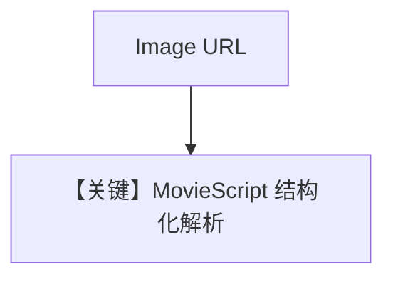

# image_to_structured_output.py — 实现原理分析

<!-- cookbook-py-source:start -->
## 完整源码

```python
"""
Image To Structured Output
=============================

Image To Structured Output.
"""

from typing import List

from agno.agent import Agent
from agno.media import Image
from agno.models.openai import OpenAIResponses
from pydantic import BaseModel, Field
from rich.pretty import pprint


class MovieScript(BaseModel):
    name: str = Field(..., description="Give a name to this movie")
    setting: str = Field(
        ..., description="Provide a nice setting for a blockbuster movie."
    )
    characters: List[str] = Field(..., description="Name of characters for this movie.")
    storyline: str = Field(
        ..., description="3 sentence storyline for the movie. Make it exciting!"
    )


# ---------------------------------------------------------------------------
# Create Agent
# ---------------------------------------------------------------------------
agent = Agent(model=OpenAIResponses(id="gpt-5.2"), output_schema=MovieScript)

# ---------------------------------------------------------------------------
# Run Agent
# ---------------------------------------------------------------------------
if __name__ == "__main__":
    response = agent.run(
        "Write a movie about this image",
        images=[
            Image(
                url="https://upload.wikimedia.org/wikipedia/commons/0/0c/GoldenGateBridge-001.jpg"
            )
        ],
        stream=True,
    )

    for event in response:
        pprint(event.content)
```

<!-- cookbook-py-source:end -->

> 源文件：`cookbook/02_agents/12_multimodal/image_to_structured_output.py`

## 概述

本示例展示 **图像输入 + `output_schema`**：`MovieScript` Pydantic 模型，`agent.run(..., images=[Image(url=...)], stream=True)`，迭代流事件 `pprint(event.content)`。

**核心配置：** `OpenAIResponses(id="gpt-5.2")`；`output_schema=MovieScript`。

## 运行机制与因果链

结构化输出强制字段：`name`/`setting`/`characters`/`storyline`；视觉信息来自 Golden Gate 图片 URL。

## System Prompt 组装

无显式 `instructions`；`output_schema` 触发 `# 3.3.15`/`# 3.3.16` JSON/格式提示（依模型能力）。

## Mermaid 流程图


```mermaid
flowchart TD
    IMG["Image URL"] --> S["【关键】MovieScript 结构化解析"]
```

## 关键源码文件索引

| 文件 | 作用 |
|------|------|
| `agno/agent` | `output_schema` 与多模态输入 |
