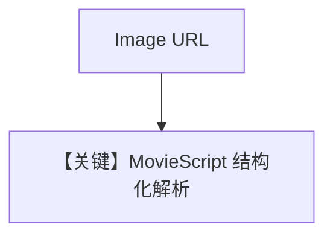

# image_to_structured_output.py — 实现原理分析

> 源文件：`cookbook/02_agents/12_multimodal/image_to_structured_output.py`

## 概述

本示例展示 **图像输入 + `output_schema`**：`MovieScript` Pydantic 模型，`agent.run(..., images=[Image(url=...)], stream=True)`，迭代流事件 `pprint(event.content)`。

**核心配置：** `OpenAIResponses(id="gpt-5.2")`；`output_schema=MovieScript`。

## 运行机制与因果链

结构化输出强制字段：`name`/`setting`/`characters`/`storyline`；视觉信息来自 Golden Gate 图片 URL。

## System Prompt 组装

无显式 `instructions`；`output_schema` 触发 `# 3.3.15`/`# 3.3.16` JSON/格式提示（依模型能力）。

## Mermaid 流程图

```mermaid
flowchart TD
    IMG["Image URL"] --> S["【关键】MovieScript 结构化解析"]
```

## 关键源码文件索引

| 文件 | 作用 |
|------|------|
| `agno/agent` | `output_schema` 与多模态输入 |
