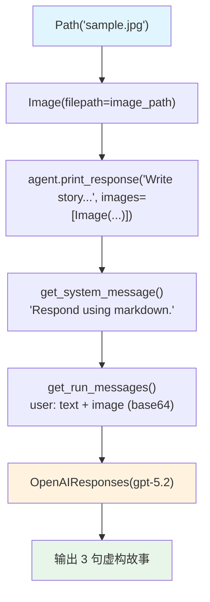

# image_to_text.py — 实现原理分析

> 源文件：`cookbook/02_agents/12_multimodal/image_to_text.py`

## 概述

本示例展示 Agno 最简单的 **图像理解（图像转文字）** 用法：Agent 读取本地 JPG 图像，生成 3 句话的虚构故事，是多模态最基础的示例。

**核心配置一览：**

| 配置项 | 值 | 说明 |
|--------|------|------|
| `model` | `OpenAIResponses(id="gpt-5.2")` | Responses API |
| `markdown` | `True` | Markdown 格式 |
| `instructions` | `None` | 未设置 |
| `tools` | `None` | 未设置 |

## 架构分层

```
用户代码层                    agno.agent 层
┌──────────────────────┐    ┌──────────────────────────────────────┐
│ image_to_text.py     │    │ Agent._run()                          │
│                      │    │  ├─ get_system_message()              │
│ image_path =         │    │  │   → "Respond using markdown."      │
│   Path(__file__).    │    │  └─ get_run_messages()                │
│   parent / "sample.  │    │      ├─ system message                │
│   jpg"               │    │      └─ user(text + image_base64)     │
│                      │───>│                                       │
│ agent.print_response │    └──────────────────────────────────────┘
│   ("Write story...", │                   │
│    images=[Image(    │                   ▼
│      filepath=       │    ┌──────────────────────────────────────┐
│      image_path)])   │    │ OpenAIResponses                       │
│                      │    │ gpt-5.2                               │
└──────────────────────┘    └──────────────────────────────────────┘
```

## 核心组件解析

### Image 媒体类（本地文件）

```python
from agno.media import Image
from pathlib import Path

image_path = Path(__file__).parent.joinpath("sample.jpg")

agent.print_response(
    "Write a 3 sentence fiction story about the image",
    images=[Image(filepath=image_path)],  # 本地文件自动 base64 编码
)
```

### filepath vs url 的差异

| 方式 | 示例 | 处理方式 |
|------|------|---------|
| `filepath` | `Image(filepath=Path("sample.jpg"))` | 本地文件读取后 base64 编码 |
| `url` | `Image(url="https://...")` | 直接传 URL 给模型 |

## System Prompt 组装

```text
Respond using markdown.
```

## 完整 API 请求

```python
client.responses.create(
    model="gpt-5.2",
    input=[
        {"role": "developer", "content": "Respond using markdown."},
        {"role": "user", "content": [
            {"type": "input_text", "text": "Write a 3 sentence fiction story about the image"},
            {"type": "input_image", "image_url": "data:image/jpeg;base64,<base64_data>"}
        ]}
    ],
    stream=False
)
```

## Mermaid 流程图



## 关键源码文件索引

| 文件 | 关键函数/类 | 作用 |
|------|------------|------|
| `agno/media/__init__.py` | `Image` | 图像媒体（filepath/url） |
| `agno/models/openai/responses.py` | `OpenAIResponses` | Responses API |
| `agno/agent/_messages.py` | `get_run_messages()` L1265 | 用户消息含图像 |
