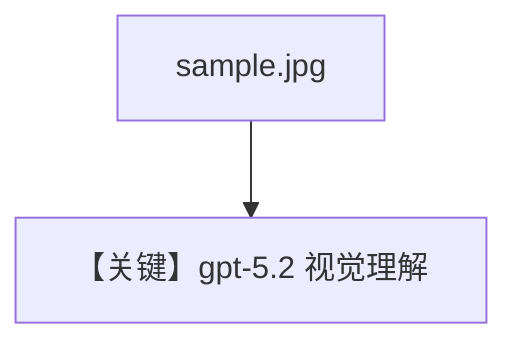

# image_to_text.py — 实现原理分析

> 源文件：`cookbook/02_agents/12_multimodal/image_to_text.py`

## 概述

本示例展示 **最小图像→文本**：`OpenAIResponses` + 本地 `sample.jpg`，`images=[Image(filepath=...)]`，用户消息为三句小说要求。

**核心配置：** `markdown=True`。

## 运行机制与因果链

纯视觉理解，无工具；适合作为多模态入门。

参照用户句：`Write a 3 sentence fiction story about the image`

## 完整 API 请求

`OpenAIResponses` 将图像编码进 `input`（见 `_format_messages`）。

## Mermaid 流程图

```mermaid
flowchart TD
    J["sample.jpg"] --> R["【关键】gpt-5.2 视觉理解"]
```

## 关键源码文件索引

| 文件 | 作用 |
|------|------|
| `agno/utils/models/openai_responses` | `images_to_message` 等 |
