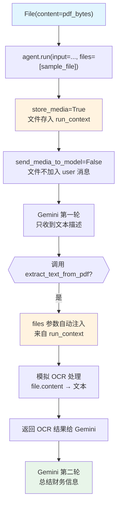

# media_input_for_tool.py — 实现原理分析

> 源文件：`cookbook/02_agents/12_multimodal/media_input_for_tool.py`

## 概述

本示例展示 Agno 的 **工具访问媒体文件**机制：通过 `send_media_to_model=False` + `store_media=True` 配置，文件不直接发送给 LLM，而是存储在 Agent 内部，工具函数通过 `files: Optional[Sequence[File]]` 参数自动注入文件内容，实现自定义文件处理（如 OCR）。

**核心配置一览：**

| 配置项 | 值 | 说明 |
|--------|------|------|
| `model` | `Gemini(id="gemini-2.5-pro")` | Gemini 模型 |
| `tools` | `[DocumentProcessingTools()]` | 自定义 Toolkit |
| `name` | `"Document Processing Agent"` | Agent 名称 |
| `description` | `"An agent that can process uploaded documents."` | 描述 |
| `debug_mode` | `True` | 调试模式 |
| `send_media_to_model` | `False` | 文件不发给模型 |
| `store_media` | `True` | 文件存储在 Agent 内部 |

## 架构分层

```
用户代码层                    agno.agent 层
┌──────────────────────┐    ┌──────────────────────────────────────┐
│ media_input_for_     │    │ Agent._run()                          │
│ tool.py              │    │  ├─ store_media=True: 保存文件        │
│                      │    │  ├─ send_media_to_model=False:        │
│ agent.run(           │    │  │   files 不加入 user 消息           │
│   input=...,         │───>│  ├─ 模型调用 extract_text_from_pdf   │
│   files=[sample_file]│    │  └─ 工具参数 files= 自动注入文件     │
│ )                    │    └──────────────────────────────────────┘
│                      │               │              │
└──────────────────────┘               ▼              ▼
                            ┌──────────────┐  ┌──────────────────┐
                            │ Gemini       │  │ DocumentProcessing│
                            │ gemini-2.5-pro│  │ Tools.extract_   │
                            └──────────────┘  │ text_from_pdf()  │
                                              └──────────────────┘
```

## 核心组件解析

### send_media_to_model vs store_media

```python
agent = Agent(
    model=Gemini(id="gemini-2.5-pro"),
    tools=[DocumentProcessingTools()],
    send_media_to_model=False,  # 文件不进入 LLM 上下文（节省 token）
    store_media=True,           # 文件存储在 run_context，工具可访问
)
```

| 配置组合 | 效果 |
|---------|------|
| `send_media_to_model=True`（默认） | 文件以 base64 发给模型，模型直接理解 |
| `send_media_to_model=False + store_media=True` | 文件由工具处理，模型只收到文本描述 |

### 工具自动注入文件

```python
class DocumentProcessingTools(Toolkit):
    def extract_text_from_pdf(
        self,
        files: Optional[Sequence[File]] = None  # 自动注入：来自 agent.run(files=[...])
    ) -> str:
        if not files:
            return "No files were uploaded to process."
        
        for file in files:
            if file.content:
                file_size = len(file.content)
                # ... 处理文件内容 ...
```

`files` 参数由 Agno 在工具调用时自动从 `run_context` 注入，工具开发者无需手动传递。

### File 媒体类

```python
from agno.media import File

pdf_content = create_sample_pdf_content()  # bytes
sample_file = File(content=pdf_content)    # 封装为 File 对象

response = agent.run(
    input="I've uploaded a PDF document. Please extract...",
    files=[sample_file],
    session_id="test_files",
)
```

## System Prompt 组装

| 序号 | 组成部分 | 值 | 是否生效 |
|------|---------|-----|---------|
| 3.3.1 | `description` | "An agent that can process uploaded documents..." | 是 |
| 3.2.4 | `add_name_to_context` | "Document Processing Agent" | 是 |

### 最终 System Prompt

```text
Your name is: Document Processing Agent

An agent that can process uploaded documents. Use the tool to extract text from the PDF.
```

## 完整 API 请求

```python
# 文件不在 user 消息中（send_media_to_model=False）
client.generate_content(
    model="gemini-2.5-pro",
    contents=[
        {"role": "user", "parts": [
            {"text": "I've uploaded a PDF document. Please extract the text and summarize..."}
            # 注意：无 inline_data（文件不发给模型）
        ]}
    ],
    system_instruction="Your name is: Document Processing Agent\nAn agent...",
    tools=[{
        "function_declarations": [{
            "name": "extract_text_from_pdf",
            "description": "Extract text from uploaded PDF files using OCR.",
            "parameters": {}
        }]
    }]
)

# 第二轮：工具返回 OCR 结果
contents=[
    ...,
    {"role": "model", "parts": [{"function_call": {"name": "extract_text_from_pdf"}}]},
    {"role": "user", "parts": [{"function_response": {"name": "extract_text_from_pdf", "response": {"result": "...OCR 文本..."}}}]}
]
```

## Mermaid 流程图



## 关键源码文件索引

| 文件 | 关键函数/类 | 作用 |
|------|------------|------|
| `agno/media/__init__.py` | `File` | 文件媒体封装 |
| `agno/tools/toolkit.py` | `Toolkit` | 自定义工具集基类 |
| `agno/models/google/` | `Gemini` | Gemini 适配层 |
| `agno/agent/agent.py` | `send_media_to_model`, `store_media` | 媒体处理配置 |
