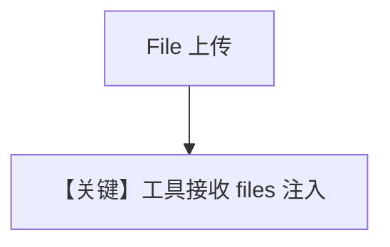

# media_input_for_tool.py — 实现原理分析

<!-- cookbook-py-source:start -->
## 完整源码

```python
"""
Media Input For Tool
=============================

Example showing how tools can access media (images, videos, audio, files) passed to the agent.
"""

from typing import Optional, Sequence

from agno.agent import Agent
from agno.media import File
from agno.models.google import Gemini
from agno.models.openai import OpenAIResponses  # noqa: F401
from agno.tools import Toolkit


# ---------------------------------------------------------------------------
# Create Agent
# ---------------------------------------------------------------------------
class DocumentProcessingTools(Toolkit):
    def __init__(self):
        tools = [
            self.extract_text_from_pdf,
        ]

        super().__init__(name="document_processing_tools", tools=tools)

    def extract_text_from_pdf(self, files: Optional[Sequence[File]] = None) -> str:
        """
        Extract text from uploaded PDF files using OCR.

        This tool can access any files that were passed to the agent.
        In a real implementation, you would use a proper OCR service.

        Args:
            files: Files passed to the agent (automatically injected)

        Returns:
            Extracted text from the PDF files
        """
        if not files:
            return "No files were uploaded to process."

        print(f"--> Files: {files}")

        extracted_texts = []
        for i, file in enumerate(files):
            if file.content:
                # Simulate OCR processing
                # In reality, you'd use a service like Tesseract, AWS Textract, etc.
                file_size = len(file.content)
                extracted_text = f"""
                    [SIMULATED OCR RESULT FOR FILE {i + 1}]
                    Document processed successfully!
                    File size: {file_size} bytes

                    Sample extracted content:
                    "This is a sample document with important information about quarterly sales figures.
                    Q1 Revenue: $125,000
                    Q2 Revenue: $150,000
                    Q3 Revenue: $175,000

                    The growth trend shows a 20% increase quarter over quarter."
                """
                extracted_texts.append(extracted_text)
            else:
                extracted_texts.append(
                    f"File {i + 1}: Content is empty or inaccessible."
                )

        return "\n\n".join(extracted_texts)


def create_sample_pdf_content() -> bytes:
    """Create a sample PDF-like content for demonstration."""
    # This is just sample binary content - in reality you'd have actual PDF bytes
    sample_content = """
    %PDF-1.4
    Sample PDF content for demonstration
    This would be actual PDF binary data in a real scenario
    """.encode("utf-8")
    return sample_content


def main():
    # Create an agent with document processing tools
    agent = Agent(
        # model=OpenAIResponses(id="gpt-5.2"),
        model=Gemini(id="gemini-2.5-pro"),
        tools=[DocumentProcessingTools()],
        name="Document Processing Agent",
        description="An agent that can process uploaded documents. Use the tool to extract text from the PDF.",
        debug_mode=True,
        send_media_to_model=False,
        store_media=True,
    )

    print("=== Tool Media Access Example ===\n")

    # Example 1: PDF Processing
    print("1. Testing PDF processing...")

    # Create sample file content
    pdf_content = create_sample_pdf_content()
    sample_file = File(content=pdf_content)

    response = agent.run(
        input="I've uploaded a PDF document. Please extract the text from it and summarize the key financial information.",
        files=[sample_file],
        session_id="test_files",
    )

    print(f"Agent Response: {response.content}")
    print("\n" + "=" * 50 + "\n")


# ---------------------------------------------------------------------------
# Run Agent
# ---------------------------------------------------------------------------
if __name__ == "__main__":
    main()
```

<!-- cookbook-py-source:end -->

> 源文件：`cookbook/02_agents/12_multimodal/media_input_for_tool.py`

## 概述

本示例展示 **工具参数注入 `files`**：`DocumentProcessingTools.extract_text_from_pdf(files=...)` 由框架把 **本轮用户上传的 File** 传入；`send_media_to_model=False` 避免把二进制再发给大模型，仅工具侧 OCR 模拟。

**核心配置一览：**

| 配置项 | 值 |
|--------|-----|
| `model` | `Gemini(id="gemini-2.5-pro")` |
| `send_media_to_model` | `False` |
| `store_media` | `True` |
| `debug_mode` | `True` |

## 运行机制与因果链

`agent.run(..., files=[sample_file])` → 模型选择工具 → **files 注入工具** → 返回模拟 OCR 文本。

## Mermaid 流程图


```mermaid
flowchart TD
    F["File 上传"] --> T["【关键】工具接收 files 注入"]
```

## 关键源码文件索引

| 文件 | 作用 |
|------|------|
| `agno/agent/_tools.py` | 媒体注入工具签名 |
