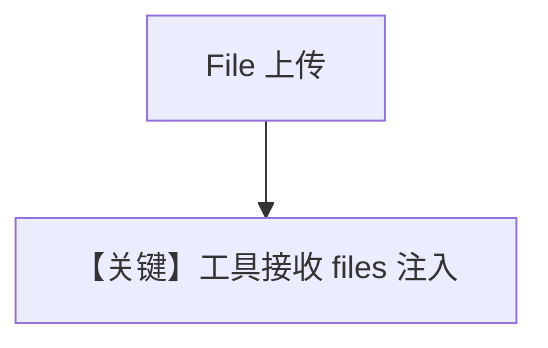

# media_input_for_tool.py — 实现原理分析

> 源文件：`cookbook/02_agents/12_multimodal/media_input_for_tool.py`

## 概述

本示例展示 **工具参数注入 `files`**：`DocumentProcessingTools.extract_text_from_pdf(files=...)` 由框架把 **本轮用户上传的 File** 传入；`send_media_to_model=False` 避免把二进制再发给大模型，仅工具侧 OCR 模拟。

**核心配置一览：**

| 配置项 | 值 |
|--------|-----|
| `model` | `Gemini(id="gemini-2.5-pro")` |
| `send_media_to_model` | `False` |
| `store_media` | `True` |
| `debug_mode` | `True` |

## 运行机制与因果链

`agent.run(..., files=[sample_file])` → 模型选择工具 → **files 注入工具** → 返回模拟 OCR 文本。

## Mermaid 流程图

```mermaid
flowchart TD
    F["File 上传"] --> T["【关键】工具接收 files 注入"]
```

## 关键源码文件索引

| 文件 | 作用 |
|------|------|
| `agno/agent/_tools.py` | 媒体注入工具签名 |
