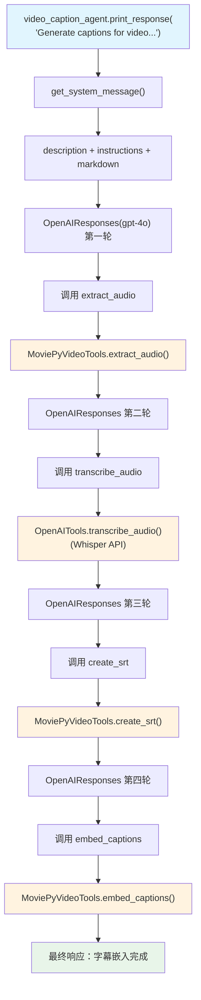

# video_caption.py — 实现原理分析

> 源文件：`cookbook/02_agents/12_multimodal/video_caption.py`

## 概述

本示例展示 Agno 的 **视频字幕生成管道**：使用 `MoviePyVideoTools` 和 `OpenAITools` 组合，Agent 按顺序执行视频处理流程：提取音频 → 转录 → 生成 SRT → 嵌入字幕，实现端到端自动字幕生成。

**核心配置一览：**

| 配置项 | 值 | 说明 |
|--------|------|------|
| `name` | `"Video Caption Generator Agent"` | Agent 名称 |
| `model` | `OpenAIResponses(id="gpt-4o")` | Responses API |
| `tools` | `[video_tools, openai_tools]` | 视频处理 + OpenAI 工具 |
| `description` | `"You are an AI agent that can generate and embed captions for videos."` | 描述 |
| `instructions` | `[4条处理步骤]` | 视频处理流程指令 |
| `markdown` | `True` | Markdown 格式 |

## 架构分层

```
用户代码层                    agno.agent 层
┌──────────────────────┐    ┌──────────────────────────────────────┐
│ video_caption.py     │    │ Agent._run()                          │
│                      │    │  ├─ get_system_message()              │
│ MoviePyVideoTools(   │    │  │   → description + instructions    │
│   enable_process_    │    │  └─ 工具调用序列:                    │
│   video=True,        │    │      1. extract_audio               │
│   enable_generate_   │───>│      2. transcribe_audio (OpenAI)   │
│   captions=True,     │    │      3. create_srt                  │
│   enable_embed_      │    │      4. embed_captions              │
│   captions=True      │    └──────────────────────────────────────┘
│ )                    │              │              │
└──────────────────────┘              ▼              ▼
                          ┌──────────────┐  ┌──────────────────┐
                          │ OpenAIResponses│ │ MoviePyVideoTools│
                          │ gpt-4o        │ │ OpenAITools       │
                          └──────────────┘ └──────────────────┘
```

## 核心组件解析

### MoviePyVideoTools 配置

```python
video_tools = MoviePyVideoTools(
    enable_process_video=True,    # 启用视频处理（提取音频）
    enable_generate_captions=True, # 启用字幕生成（create_srt）
    enable_embed_captions=True,    # 启用字幕嵌入
)

openai_tools = OpenAITools()  # 用于音频转录（Whisper API）
```

### 四步工具链

```python
agent = Agent(
    instructions=[
        "When a user provides a video, process it to generate captions.",
        "Use the video processing tools in this sequence:",
        "1. Extract audio from the video using extract_audio",
        "2. Transcribe the audio using transcribe_audio",   # OpenAITools
        "3. Generate SRT captions using create_srt",        # MoviePyVideoTools
        "4. Embed captions into the video using embed_captions",
    ],
)
```

工具链执行顺序：
1. `extract_audio`（MoviePyVideoTools）→ 从视频提取音轨
2. `transcribe_audio`（OpenAITools/Whisper）→ 音频转文字
3. `create_srt`（MoviePyVideoTools）→ 生成 SRT 字幕文件
4. `embed_captions`（MoviePyVideoTools）→ 将字幕烧录进视频

## System Prompt 组装

| 序号 | 组成部分 | 值 | 是否生效 |
|------|---------|-----|---------|
| 3.2.4 | `add_name_to_context` | "Video Caption Generator Agent" | 是 |
| 3.3.1 | `description` | "You are an AI agent..." | 是 |
| 3.3.3 | `instructions` 拼接 | 4步工具链指令 | 是 |
| 3.2.1 | `markdown` | `True` | 是 |

### 最终 System Prompt

```text
Your name is: Video Caption Generator Agent

You are an AI agent that can generate and embed captions for videos.

When a user provides a video, process it to generate captions.
Use the video processing tools in this sequence:
1. Extract audio from the video using extract_audio
2. Transcribe the audio using transcribe_audio
3. Generate SRT captions using create_srt
4. Embed captions into the video using embed_captions

Respond using markdown.
```

## 完整 API 请求

```python
# 第一轮：模型决定先调用 extract_audio
client.responses.create(
    model="gpt-4o",
    input=[
        {"role": "developer", "content": "<system_prompt>"},
        {"role": "user", "content": "Generate captions for {video} and embed them"}
    ],
    tools=[
        {"type": "function", "name": "extract_audio", ...},
        {"type": "function", "name": "transcribe_audio", ...},
        {"type": "function", "name": "create_srt", ...},
        {"type": "function", "name": "embed_captions", ...},
    ],
    stream=True
)
# → 多轮工具调用（每步一轮 API 请求）
```

## Mermaid 流程图



## 关键源码文件索引

| 文件 | 关键函数/类 | 作用 |
|------|------------|------|
| `agno/tools/moviepy_video.py` | `MoviePyVideoTools` | 视频处理工具集 |
| `agno/tools/openai.py` | `OpenAITools` | Whisper 转录等 OpenAI 工具 |
| `agno/models/openai/responses.py` | `OpenAIResponses` | Responses API |
| `agno/agent/_messages.py` | `get_system_message()` L163-174 | instructions 解析 |
