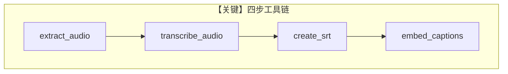

# video_caption.py — 实现原理分析

> 源文件：`cookbook/02_agents/12_multimodal/video_caption.py`

## 概述

本示例展示 **MoviePy + OpenAI 工具链生成字幕**：`MoviePyVideoTools` 开启处理/字幕/嵌入，`OpenAITools` 辅助；`instructions` 规定 **extract_audio → transcribe_audio → create_srt → embed_captions** 顺序。

**核心配置：** `OpenAIResponses(id="gpt-4o")`；`description` + 多行 `instructions`。

## 运行机制与因果链

用户提示含占位 `{video with location}`（示例字符串）；Agent 编排多工具完成视频管线。

## Mermaid 流程图

```mermaid
flowchart TD
    subgraph Pipeline["【关键】四步工具链"]
        A["extract_audio"] --> B["transcribe_audio"]
        B --> C["create_srt"]
        C --> D["embed_captions"]
    end
```

## 关键源码文件索引

| 文件 | 作用 |
|------|------|
| `agno/tools/moviepy_video` | `MoviePyVideoTools` |
| `agno/tools/openai` | `OpenAITools` |
