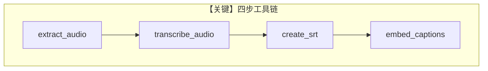

# video_caption.py — 实现原理分析

<!-- cookbook-py-source:start -->
## 完整源码

```python
"""
Video Caption
=============================

Please install dependencies using:.
"""

from agno.agent import Agent
from agno.models.openai import OpenAIResponses
from agno.tools.moviepy_video import MoviePyVideoTools
from agno.tools.openai import OpenAITools

video_tools = MoviePyVideoTools(
    enable_process_video=True, enable_generate_captions=True, enable_embed_captions=True
)

openai_tools = OpenAITools()

# ---------------------------------------------------------------------------
# Create Agent
# ---------------------------------------------------------------------------
video_caption_agent = Agent(
    name="Video Caption Generator Agent",
    model=OpenAIResponses(
        id="gpt-4o",
    ),
    tools=[video_tools, openai_tools],
    description="You are an AI agent that can generate and embed captions for videos.",
    instructions=[
        "When a user provides a video, process it to generate captions.",
        "Use the video processing tools in this sequence:",
        "1. Extract audio from the video using extract_audio",
        "2. Transcribe the audio using transcribe_audio",
        "3. Generate SRT captions using create_srt",
        "4. Embed captions into the video using embed_captions",
    ],
    markdown=True,
)

# ---------------------------------------------------------------------------
# Run Agent
# ---------------------------------------------------------------------------
if __name__ == "__main__":
    video_caption_agent.print_response(
        "Generate captions for {video with location} and embed them in the video"
    )
```

<!-- cookbook-py-source:end -->

> 源文件：`cookbook/02_agents/12_multimodal/video_caption.py`

## 概述

本示例展示 **MoviePy + OpenAI 工具链生成字幕**：`MoviePyVideoTools` 开启处理/字幕/嵌入，`OpenAITools` 辅助；`instructions` 规定 **extract_audio → transcribe_audio → create_srt → embed_captions** 顺序。

**核心配置：** `OpenAIResponses(id="gpt-4o")`；`description` + 多行 `instructions`。

## 运行机制与因果链

用户提示含占位 `{video with location}`（示例字符串）；Agent 编排多工具完成视频管线。

## Mermaid 流程图


```mermaid
flowchart TD
    subgraph Pipeline["【关键】四步工具链"]
        A["extract_audio"] --> B["transcribe_audio"]
        B --> C["create_srt"]
        C --> D["embed_captions"]
    end
```

## 关键源码文件索引

| 文件 | 作用 |
|------|------|
| `agno/tools/moviepy_video` | `MoviePyVideoTools` |
| `agno/tools/openai` | `OpenAITools` |
